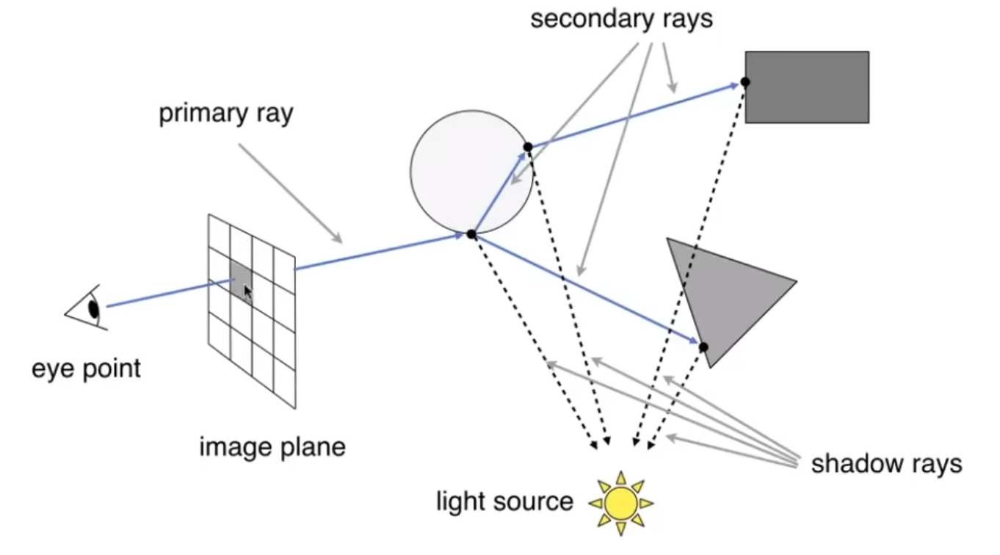

# <center>Lec 13 14 Note</center>

## 一、 为什么需要光线追踪？
通过光栅化，我们已经能够渲染出不错的图像，但它在处理全局光照效果时存在局限。

### 1. 光栅化的局限

#### 1.1 Shadow Mapping
这是光栅化中实现阴影的常用技术。其核心思想是：一个点如果不在阴影中，那么它必须既能被摄像机看到，也能被光源看到。

- **实现步骤**
  - **Pass 1**: 将摄像机放置在光源位置，渲染一次场景，但不记录颜色，只记录每个像素的深度值，生成一张**阴影贴图 (Shadow Map)**。
  - **Pass 2**: 从原始摄像机视角正常渲染场景。对于每个着色点，将其变换回光源的坐标系，并查询其在阴影贴图上的深度值。
  - **比较深度**: 比较该点到光源的实际距离和记录的深度值。如果实际距离大于记录的深度值，说明有其他物体挡在该点和光源之间，该点处于阴影中。

- **问题**
  - **硬阴影**: 这种方法只能产生**硬阴影 (Hard Shadows，非零即一)**，因为光源被假定为一个点。
  
  - **分辨率限制**: 阴影贴图的分辨率限制了阴影的质量，可能导致锯齿状边缘。
  - **精度问题**: 深度比较时存在浮点数精度问题，容易产生“阴影粉刺 (Shadow Acne)”现象。

#### 1.2 全局效果的挑战
 除了软阴影，光栅化很难优雅地处理间接光照（光线多次弹射）、磨砂质感的反射 (Glossy Reflection)等需要考虑全局信息的光照现象。

### 2. 光线追踪的优势
光线追踪 (Ray Tracing) 是一种物理上更精确的渲染方法，它通过模拟光的传播路径来生成图像。

- **优点**: 能够自然、准确地处理各种全局光照效果，生成非常逼真的图像。

- **缺点**: 计算量巨大，传统上用于离线渲染（如电影特效），渲染一帧可能需要数千个CPU小时。

## 二、 光线追踪的基本原理
### 1. 光的传播假设
为了简化模型，提出三个基本假设：

- 光沿直线传播。

- 光线之间不会发生碰撞。

- **光路可逆性 (Reciprocity)**: 从光源A出发到达人眼B的光路，与从人眼B出发到达光源A的光路是完全相同的。

    基于光路可逆性，可以进行反向思考：一个像素的颜色，取决于**从人眼出发，穿过该像素的光线**最终“看到”了什么。这极大地减少了计算量，因为我们只计算那些真正能被看到的、有贡献的光线。

### 2. 光线投射 (Ray Casting)

**1. 生成眼睛光线 (Eye Ray)** \
   对于屏幕上的每一个像素，从摄像机（眼睛）位置向该像素中心发射一条**主光线 (Primary Ray)**。

**2. 光线与场景求交** \
计算这条光线与场景中所有物体的交点，并找到最近的那个交点。这个过程天然地解决了遮挡问题。

**3. 着色 (Shading)** 
- 在交点处，向场景中的**每一个光源**发射一条**阴影光线 (Shadow Ray)**。

- 如果阴影光线在到达光源前没有碰到任何其他物体，说明该点被该光源照亮。

- 使用Blinn-Phong等局部光照模型，计算该点的颜色。

- 将计算出的颜色赋给对应的像素。

### 3. Whitted-Style 递归光线追踪
由Turner Whitted于1979年提出，它在Ray Casting的基础上增加了对镜面反射和折射的递归处理。

- **核心思想**: 当一条光线击中一个物体表面时，它可能会分裂成三部分：

    1. **局部光照贡献**: 与Ray Casting一样，连接光源计算直接光照和阴影。

    2. **反射光线 (Reflected Ray)**: 如果表面是镜面反射材质，则根据入射方向和表面法线计算出反射方向，并从交点处递归地发射一条新的反射光线。

    3. **折射光线 (Refracted Ray)**: 如果表面是透明/半透明材质，则根据斯涅尔定律计算出折射方向，并从交点处递归地发射一条新的折射光线。\
    

- **递归过程**

    1. 每一条新生成的反射/折射光线都会继续与场景求交，并在新的交点处重复上述过程。

    2. 最终一个像素的颜色，是这个递归“光线树”上所有光照贡献的总和。

    3. 递归需要一个终止条件，例如设置一个最大反弹次数。

## 三、 核心计算：光线与表面求交
光线追踪的核心运算就是求解光线与物体表面的交点。

### 1. 光线的数学表示
一条光线可以用其**起点** $o$ 和**单位方向向量** $\hat{d}$ 来参数化表示：

$$
r(t)=o+td,where t≥0
$$
参数 t 代表了光线上传播的距离。

### 2. 光线与隐式曲面求交（以球面为例）
- **球面方程**: 
    $$(p-c)^2 = R^2$$
    其中 $p$ 是球面上任意一点，$c$ 是球心，$R$ 是半径。

- **求解**: 将光线方程代入球面方程，即令 $p = o + td$，得到：
    $$(o+td-c)^2 = R^2$$
    展开后得到一个关于 t 的二次方程：
    $$(o+td-c) \cdot (o+td-c) - R^2 = 0$$
    即
    $$(o-c)^2 + 2(o-c) \cdot td + t^2d^2 - R^2 = 0$$
    将其整理为标准形式：
    $$at^2 + bt + c = 0$$
    其中
    - 若判别式 <0，无交点。

    - 若判别式 =0，一个交点（相切）。

    - 若判别式 >0，两个交点。
    我们需要取其中最小的、且为正数的 t 值作为最近的交点。

### 3. 光线与显式曲面求交（以三角形为例）
最直接的方法是遍历场景中的每一个三角形，分别进行求交测试。

- **两步法**

    1. 计算光线与三角形所在平面的交点。

    2. 判断该交点是否在三角形内部。

- **Möller-Trumbore 算法** \
    这是一种更高效的、将上述两步合二为一的算法。它直接求解一个线性方程组，该方程组同时包含了光线参数 $t$ 和交点在三角形内的重心坐标 $b_1, b_2$。

    $$
    o + td = (1-b_1-b_2)P_0 + b_1P_1 + b_2P_2
    $$
    
    通过解这个方程，我们可以直接得到 $t, b1, b2$。如果求出的解满足 $t > 0$ 且重心坐标的条件（$b1 > 0, b2 > 0, 1 - b1 - b2 > 0$），则光线与该三角形相交。

## 四、 光线追踪的性能瓶颈与加速
### 1. 性能挑战
朴素的光线追踪算法极其缓慢，因为其计算复杂度为：
#像素数 × #场景中的物体数 × #光线弹射次数
对于一个包含数百万三角形的复杂场景，这种计算量是无法接受的。

### 2. 包围盒 (Bounding Volumes)
为了避免对每一个物体都进行耗时的求交测试，我们引入了加速结构。其核心思想是：用一个简单的几何体（包围盒）将一个或一组复杂的物体包围起来。

- **工作原理**
  - **预处理**: 在渲染前，为场景中的物体或物体集群创建一个或多个包围盒。

  - **求交测试**: 当光线与包围盒进行求交测试时，如果光线没有击中包围盒，那么它也不可能击中包围盒内部的任何物体，这样我们就可以跳过对内部所有物体的复杂求交测试。

  - **递归细分**: 如果光线击中包围盒，则继续对包围盒内的物体进行求交测试。


### 3. 轴对齐包围盒 (Axis-Aligned Bounding Box, AABB)
AABB是一种非常常用的包围盒，它的所有面都**与坐标系的X, Y, Z轴平行**。

- **优点**: 判断内外和求交计算都非常简单高效。

- **定义**: 一个AABB可以由其在三个轴上的最小和最大坐标 $(x_{min}, y_{min}, z_{min})$ 和 $(x_{max}, y_{max}, z_{max})$ 来定义。

### 4. 光线与AABB的求交算法

#### 4.1 基本思想
   一个AABB可以看作是三个**无限大的“平板” (Slab)** 对的交集（一对X方向的，一对Y方向的，一对Z方向的）。

#### 4.2 计算进入/离开时间

- 对于光线和**每一个轴**（如X轴），计算光线进入平板（穿过$x_{min}$平面）和离开平板（穿过$x_{max}$平面）的时间 $t_{min}$ 和 $t_{max}$。

- 对三个轴都进行这个计算，得到三组 $(t_{min}, t_{max})$ 区间。

#### 4.3 求交集

- 光线真正进入AABB的时间，是它进入所有三个平板的时间中的**最晚**的那个，即 $t_{enter} = max(t_{min_x}, t_{min_y}, t_{min_z})$。

- 光线真正离开AABB的时间，是它离开任何一个平板的时间中的**最早**的那个，即 $t_{exit} = min(t_{max_x}, t_{max_y}, t_{max_z})$。

#### 4.4 判断相交

当前仅当 $t_{enter} < t_{exit} 且 t_{exit} >= 0$，说明光线在AABB内部停留了一段时间，即光线与AABB相交。

## 五、 空间划分 (Spatial Partitions)

### 1. 均匀空间划分 (Uniform Grids)
- **思想**: 将整个场景的包围盒划分为一个规整的、三维的**网格 (Grid)**。

- **预处理**:

    1. 确定网格的分辨率。

    2. 将每个物体放入所有与之有交集的网格单元 (cell) 中。

- **遍历**:

    1. 确定光线首先进入哪个网格单元。

    2. 沿着光线方向，逐个“走进”下一个相交的网格单元。

    3. 在每个进入的单元格中，只与该单元格内的物体进行求交测试。

- **问题**: 这种方法对物体分布均匀的场景很有效，但对于分布极不均匀的场景（所谓的 **“茶壶在体育场”问题**）效率低下。大部分网格是空的，光线遍历会浪费大量时间；而少数包含大量物体的网格又会导致求交计算过于集中。

### 2. KD-Tree
KD-Tree是一种**自适应**的空间划分方法，它会根据物体的分布来不均匀地划分空间。

- **思想**: 每次用一个与坐标轴平行的平面，将当前空间一分为二，形成一个二叉树结构。

- **构建**: 递归地进行划分，每次循环选择一个轴（如X, Y, Z, X, Y, Z...），并找到一个合适的位置（如物体重心坐标的中位数）进行切割，直到每个子空间（叶子节点）中的物体数量小于某个**阈值**。

- **优点**: 能够自适应场景密度。

- **缺点**:

    1. 一个物体可能会横跨多个空间区域，导致其需要被存储在**多个叶子节点**中。

    2. 判断三角形与划分出的包围盒是否相交并不简单。

## 六、 物体划分 (Object Partitions)
与划分空间不同，另一种更现代、更主流的思路是**划分物体**。
**BVH (Bounding Volume Hierarchy)** 结构是目前业界应用最广泛的加速结构。

### 1. 思想
不划分空间，而是将物体的集合递归地划分为两个子集，并为每个子集计算一个更紧密的包围盒。

### 2. 数据结构

- **中间节点**: 存储一个**包围盒**（包含其所有子节点中的物体）以及指向两个子节点的指针。

- **叶子节点**: 存储一个**包围盒**和该包围盒内包含的少量**物体列表**。

### 3. 构建 (Heuristics)

- **选择划分轴**: 通常选择当前节点包围盒**最长**的那个轴。

- **选择划分位置**: 通常选择物体集合的**中位数**，以保证树的平衡。

- **递归**: 将物体划分为两个子集，并为每个子集递归地构建子树，直到叶子节点中的物体数量小于**某个阈值**。

### 4. 遍历 (Traversal)
这是一个**递归**的过程：

```C++
function Intersect(Ray ray, BVH_Node node) {
    if (ray does not intersect node.bbox) {
        return no_hit;
    }

    if (node is a leaf_node) {
        return intersect_ray_with_all_objects_in(node);
    }

    hit1 = Intersect(ray, node.child1);
    hit2 = Intersect(ray, node.child2);

    return the closer hit of hit1 and hit2;
}
```

### 5. BVH vs. KD-Tree

- **KD-Tree**: 划分空间，**空间区域不重叠**，但一个物体可属于**多个区域**。

- **BVH**: 划分物体，物体集合**不相交**，但子节点的**包围盒可以重叠**。

由于其构建和遍历的简洁性与高效性，BVH在现代光线追踪中是更受青睐的选择。