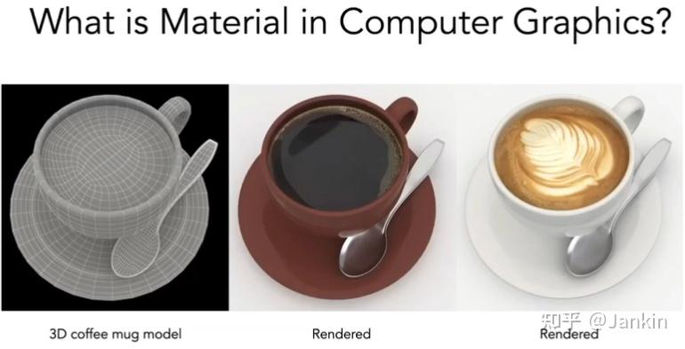

# 
 Lecture 17 Note

## 一、 什么是材质？

**材质 (Material)** 决定了一个物体看起来是什么样的。无论是磨砂的塑料、光滑的金属，还是透明的玻璃，它们的视觉差异都源于其独特的材质属性。

从物理角度看，材质的本质是**描述光线与物体表面如何交互** 。这个交互过程的核心，是之前提到的 **双向反射分布函数 (Bidirectional Reflectance Distribution Function, BRDF)**。可以说，在图形学中，**材质就是BRDF**。

## 二、 基础材质模型

### 1. 漫反射 (Diffuse)

这是最基础的材质模型，用于描述那些表面粗糙、无光泽的物体，如石膏、粉笔、哑光墙面等。

  - **特性**: 无论光线从哪个角度射入，它都会被均匀地反射到表面上方的所有方向。
  - **BRDF**: 对于理想的漫反射体，其BRDF是一个常数：
    $$f_r = \frac{\rho}{\pi}$$
      - $\rho$ 被称为 **反照率 (Albedo)**，它表示物体表面反射光能的比例，取值范围是 `[0, 1]`。可以简单地理解为物体的“颜色”。
      - 分母中的 $\pi$ 是为了保证**能量守恒**。一个反射率为100% (即 $\rho=1$) 的表面，其BRDF值最大也只能是 $1/\pi$。

    - **示例**: 下图展示了一个咖啡杯模型在仅有漫反射材质（左）和增加了纹理贴图的漫反射材质（右）下的渲染效果。

    

    
     
    

### 2. 镜面反射与折射 (Specular & Refractive)

这类材质描述的是光滑表面，如镜子、玻璃、水面等。光线与这类表面交互时主要发生两种现象：反射和折射。

#### 2.1 镜面反射 (Perfect Specular Reflection)

  - 光线会被完美地反射到单一方向。
  - 遵循反射定律：入射角等于反射角 ($\theta_i = \theta_o$)。出射光线方向 $\omega_o$ 可以由入射光线方向 $\omega_i$ 和法线 $\vec{n}$ 计算得出：$\omega_{o}=-\omega_{i}+2(\omega_{i}\cdot\vec{n})\vec{n}$。

#### 2.2 折射 (Refraction)

  - 光线穿过不同介质的边界时会发生方向偏折。
  - 遵循 **斯涅尔定律 (Snell's Law)**:
    $$
    \eta_i \sin\theta_i = \eta_t \sin\theta_t
    $$
      - $\eta$ 是介质的 **折射率 (Index of Refraction, IOR)**。例如，真空的折射率约为1.0，水约为1.33，玻璃约为1.5，钻石则高达2.42。
  - **全反射 (Total Internal Reflection)**: 当光线从**光密介质**射向**光疏介质**时，如果入射角足够大，光线将无法折射出去，而是被完全反射回原介质。这就是为什么从水下看水面，只有特定角度范围（一个锥形区域）内能看到水面上的景象。

### 3. 菲涅尔效应 (Fresnel Effect)

这是一个非常关键且普遍的物理现象：**一个表面反射的光量取决于观察角度**。

  - **现象**: 当垂直看向一个非金属表面（如水面、木地板）时，它主要表现为自身的颜色（折射/漫反射为主），反射效果很弱。但如果以一个很小的掠射角（grazing angle）去看，它的反射会变得非常明显，几乎像镜子一样。

 
<small>菲涅尔效应示意图</small>

  - **导体 (Conductors) vs. 绝缘体 (Dielectrics)**:
      - **绝缘体** (如水、玻璃、塑料) 的菲涅尔效应非常明显。垂直入射时反射率很低（约2%-5%），掠射时接近100%。
      - **导体** (如金、铜、铝等金属) 则不同，它们即使在垂直入射时也具有非常高的反射率。它们的颜色也来自于这种特殊的反射属性。

由于完整的菲涅尔方程相当复杂，在实时渲染中通常使用 **Schlick's Approximation (斯涅尔近似)** 来模拟这一效应：
$$
R(\theta) = R_0 + (1 - R_0)(1 - \cos\theta)^5
$$
其中 $R_0 = (\frac{\eta_1 - \eta_2}{\eta_1 + \eta_2})^2$ 是垂直入射时的反射率。这个近似对导体和绝缘体都适用。

## 三、 微表面模型 (Microfacet Theory)

现实世界中的大部分材质，既不完全是漫反射，也不完全是理想镜面。它们通常是“有光泽的”(Glossy)，比如磨砂金属、塑料、木漆等。微表面模型是对这类材质最主流、最成功的物理解释。

  - **核心思想**: 从宏观上看，物体表面可能是粗糙的，但从微观上看，它是由无数个微小的、肉眼不可见的、可被视为完美镜面的 **微表面 (Microfacet)** 构成的。表面的宏观粗糙度是由这些微表面的法线朝向的混乱程度决定的。
      - **光滑表面**: 微表面的法线方向高度一致，趋向于宏观法线方向。
      - **粗糙表面**: 微表面的法线方向分布非常杂乱。

 
<small>法线集中(上)对应光滑表面，法线分散(下)对应粗糙表面</small>

  - **微表面BRDF**:
    $$f_r(i, o) = \frac{F(i, h) \cdot G(i, o, h) \cdot D(h)}{4(n \cdot i)(n \cdot o)}$$
    这个公式由三个核心部分组成：
    1.  **D(h) - 法线分布函数 (Normal Distribution Function, NDF)**:
        描述了微表面法线的统计分布情况。即朝向特定方向 $h$ (半程向量) 的微表面有多少。这是决定材质粗糙度的关键。
    2.  **F(i,h) - 菲涅尔项 (Fresnel Term)**:
        根据菲涅尔效应，计算每个微表面反射了多少光。
    3.  **G(i,o,h) - 几何遮蔽项 (Geometry/Shadowing-Masking Term)**:
        描述微表面之间的自遮挡。一个微表面可能被另一个微表面挡住，导致光线无法射入（Shadowing）或反射光无法射出（Masking）。这种效应在掠射角时尤其明显。

微表面模型因为其物理基础，能够极其逼真地表现从金属到塑料等各种材质，是现代PBR (Physically-Based Rendering) 渲染的基石。

## 四、 各向同性与各向异性 (Isotropic vs. Anisotropic)

  - **各向同性 (Isotropic)**: 围绕表面法线旋转物体时，其视觉表现不会发生变化。大部分材质，如塑料、陶瓷，都属于此类。它们的微观结构在所有方向上都是一致的。
  - **各向异性 (Anisotropic)**: 围绕法线旋转时，视觉表现会发生变化 。这通常是因为表面有方向性的微观结构，比如划痕或纤维。
      - **示例**: 拉丝金属、CD盘面、木头、天鹅绒 (Velvet)。拉丝金属表面的划痕会导致光线在某个方向上更容易反射，而在垂直于划痕的方向上则反射较少。

## 五、 BRDF 的物理性质

一个符合物理规律的BRDF应具备以下性质：

1. **非负性 (Non-negativity)**: $f_r(\omega_i \to \omega_r) \ge 0$。BRDF不能反射负能量。
2. **线性 (Linearity)**: 多个BRDF效果可以线性叠加。
3. **海姆霍兹互易性 (Helmholtz Reciprocity)**: 交换入射和出射方向，BRDF的值不变：$f_r(\omega_i \to \omega_r) = f_r(\omega_r \to \omega_i)$。这个性质极大地简化了BRDF的测量和光线追踪的计算。
4. **能量守恒 (Energy Conservation)**: 反射出去的总能量不能超过入射的总能量。即对所有出射方向的半球积分值应小于等于1：$\forall \omega_r, \int_{H^2} f_r(\omega_i \to \omega_r) \cos\theta_i d\omega_i \le 1$。

## 六、 BRDF 的测量

为了获得最真实的材质，人们会直接测量真实世界物体的BRDF。

  - **方法**: 使用一种名为 **Gonioreflectometer** 的设备，通过一个固定的光源和可移动的相机（或反之）来穷举测量所有入射和出射角度组合下的反射光强度。
  - **挑战**: 这是一个四维函数，数据量极其庞大，测量和存储都十分困难。
  - **数据库**: 测量出的数据会被存储起来供渲染器使用。其中最著名的是 **MERL BRDF Database**，它包含了100种测量的各向同性材质数据。