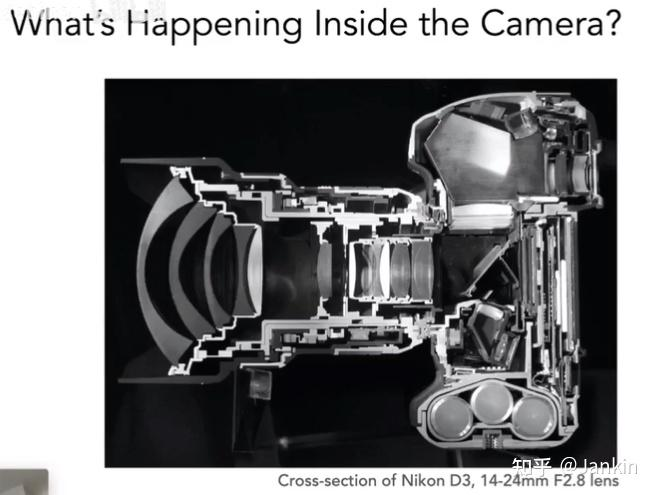
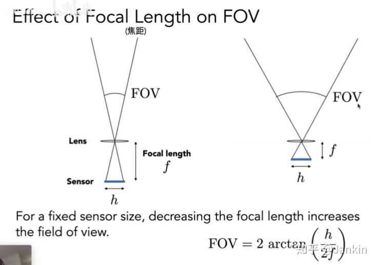
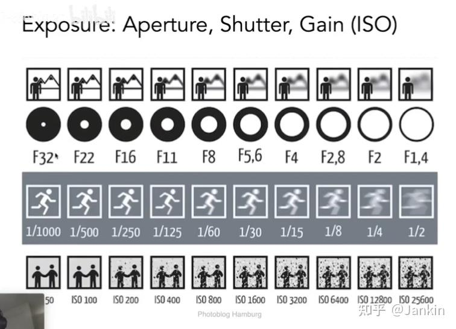
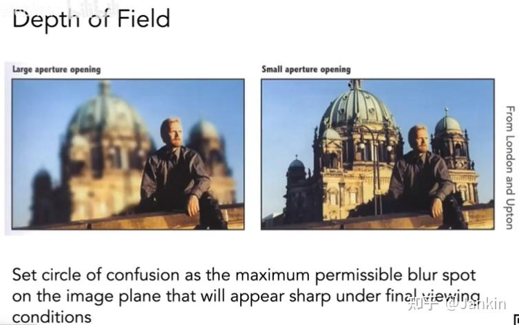
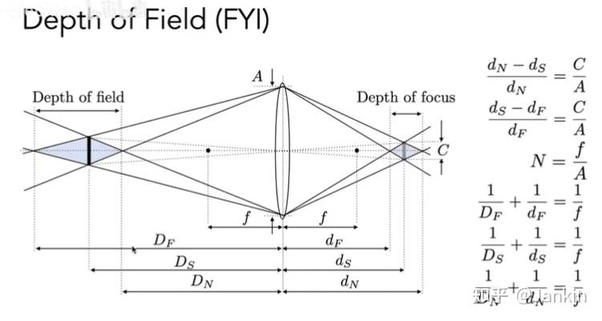

# 
 Lec 19 Note

## 一、 真实相机模型 (The Camera)
之前在光线追踪中使用的模型是针孔相机 (Pinhole Camera)，它非常简单，但无法解释真实相机的一些重要特性，如景深。真实相机是一个复杂的光学系统。

### 1. 核心组件
- **镜头 (Lens)**: 真实相机使用由多个透镜构成的复杂透镜组来代替小孔。

- **快门 (Shutter)**: 控制传感器暴露在光线下的精确时长。它像一扇快速开合的门，决定了“曝光”这个动作持续多久。

- **传感器 (Sensor)**: 一个感光平面，用于在曝光期间接收光线（物理上是“辐照度 Irradiance”），并将光信号转换为电信号，最终形成数字图像。

如果没有针孔或镜头，传感器上的每个点都会接收到来自场景中所有方向的光，导致画面一片模糊，无法形成有意义的图像。

### 2. 针孔相机回顾
- **原理**: 通过一个极小的孔来限制光线，确保传感器上的每一点只接收来自场景中特定一点的光。

- **优点**: 成像清晰，不存在失焦模糊，所有物体无论远近都是清晰的。

- **缺点**: 进光量极小，需要非常长的曝光时间才能得到一张足够明亮的照片。

- **核心限制**: 没有景深 (Depth of Field) 的概念，无法实现主体清晰、背景模糊的艺术效果。

## 二、 视场 (Field of View - FOV)
### 1. 决定因素
视场决定了相机能“看”到多大的范围，就像人眼的视野范围一样。它主要由两个因素决定：

- **焦距 (Focal Length, f)**: 镜头的光学中心到传感器的距离。

- **传感器尺寸 (Sensor Size, h)**: 感光元件的物理大小。

它们的关系可以用以下公式表示：

$$
FOV=2⋅arctan( \frac{h}{2f} )
$$

### 2. 焦距的影响:
焦距越长，视场越窄，能“看到”的**范围越小**，但每个细节都更清晰。相当于用望远镜看东西。
焦距越短，视场越宽，能“看到”的**范围越大**，但每个细节都更模糊。相当于用广角镜头拍摄。

### 3. 传感器尺寸的影响:

传感器尺寸越大，视场越宽，能“看到”的**范围越大**，但每个细节都更模糊
传感器尺寸越小，视场越窄，能“看到”的**范围越小**，但每个细节都更清晰

### 4. 等效焦距 (Equivalent Focal Length)
在摄影中，为了比较不同相机系统的视场，我们常用“等效焦距”来统一标准。它表示如果使用35mm全画幅相机拍摄同样的场景，所需的焦距是多少。\
**等效焦距**: 为了方便比较，业界统一使用“等效35mm焦距”作为标准。比如手机宣传的28mm焦距，就是指它的视野范围和一台35mm全画幅相机使用28mm镜头时看到的范围是相同的。

## 三、 曝光 (Exposure)
曝光决定了照片的整体明暗，由照片在曝光期间接收到的**总光能量**决定。**曝光 H = 曝光时间 T × 辐照度 E**

$$
H=T×E
$$
我们可以通过控制以下三个参数来获得合适的曝光，这三者被称为 **"曝光三角"**

### 1. 光圈 (Aperture):

- **作用**: 控制单位时间内进入镜头的**光量（即辐照度E）**。

- **表示**: 用 F数 (F-Number / F-Stop) 表示，如 f/1.4, f/2.8, f/8。
  - F数越小，光圈越大，单位时间内进入的光量越多，辐照度 E 越高。
  - F数越大，光圈越小，单位时间内进入的光量越少，辐照度 E 越低。

### 2. 快门速度 (Shutter Speed):

- **作用**: 控制总的曝光时间T。

- **表示**: 通常用分数表示，如 1/60s, 1/125s, 1/1000s。
  - 快门速度越快，曝光时间越短，单位时间内接收到的光量越少，辐照度 E 越低。
  - 快门速度越慢，曝光时间越长，单位时间内接收到的光量越多，辐照度 E 越高。

### 3. 感光度 (ISO):

- **作用**: 传感器的灵敏度。在数字相机中，它相当于一个信号放大器。
- **表示**: ISO值，如 ISO 100, ISO 400, ISO 1600。
  - ISO值越低，传感器对光的敏感度越低，单位时间内接收到的光量越少，辐照度 E 越低。
  - ISO值越高，传感器对光的敏感度越高，单位时间内接收到的光量越多，辐照度 E 越高。
- **副作用**: 在光线不足时，提高ISO可以让照片变亮，但代价是会同时放大传感器固有的**电子噪声**，导致画面出现不美观的噪点，显得“粗糙”，画质下降。

这三个参数可以互相组合，以达到相同的**总曝光量**。例如，在傍晚拍摄，光线不足，可以选择“开大光圈（小F数）”，或者“降低快门速度”，或者“提高ISO”，或者三者结合来获得一张明亮的照片。

## 四、 透镜 (Lens)
### 1. 真实透镜与理想透镜
真实相机中的镜头并非单个透镜，而是由多个透镜构成的复杂组合。这是因为单个、简单的透镜（如笔记中提到的球面平凸透镜）存在**光学像差（Aberrations）**，无法将来自一点的光线完美地汇聚到另一点上，导致成像不清晰。

为了简化分析，引入**理想薄透镜 (Ideal Thin Lens) 模型**。它具有以下三个理想化性质：

1. 所有平行于主光轴的光线，穿过透镜后都会汇聚于**焦点 (Focal Point)**。

2. 所有穿过焦点的光线，经过透镜后都会变成**平行于主光轴**的光线。

3. 焦距可以**任意改变**（这正是复杂透镜组在现实中所要达成的目标）。

### 2. 薄透镜公式及其推导
**薄透镜公式 (Thin Lens Equation)**精确地描述了物距、像距和焦距之间的关系：
$$\frac{1}{f} = \frac{1}{z_o} + \frac{1}{z_i}$$
其中：
- **$f$ 是透镜的焦距**
- **$z_o$ 是物距（物体到透镜的距离）**
- **$z_i$ 是像距（透镜到成像面的距离）**

​
 
## 五、 景深 (Depth of Field)
### 1. 弥散圈 (Circle of Confusion - CoC)
当一个物体不精确位于**对焦平面**上时，它在传感器上就不会形成一个清晰的点，而是会形成一个模糊的圆斑。这个圆斑就被称为**弥散圈 (Circle of Confusion, CoC)**。

- **弥散圈的计算**: 根据笔记中的几何关系和相似三角形原理，弥散圈的直径 C 与光圈的直径 A 存在如下关系：
    $$C = \frac{A \cdot |z_s - z_i|}{z_i}$$
    其中：
    - **$C$ 是弥散圈的直径**
    - **$A$ 是光圈的直径**
    - **$z_s$ 是物体到透镜的距离**
    - **$z_i$ 是像距（透镜到成像面的距离）**

### 2. 光圈F数 (F-Number)
为了标准化地描述光圈大小，使用 **F数 (F-Number / F-Stop)**。

- **定义**: F数 N 是镜头的焦距 f 与光圈直径 A 的比值。
    $$N = \frac{f}{A}$$

- **关系**: 
$$
C = \frac{f \cdot |z_s - z_i|}{N \cdot z_i}
$$
这个关系式明确指出：**F数 N 越大，光圈直径 A 越小**，最终形成的弥散圈 C 也越小。 这就是为什么使用小光圈（大F数，如f/16）拍摄时，焦外会更清晰。

### 3. 景深的定义与影响因素
**景深 (Depth of Field, DOF)** 并不是一个物理概念，而是一个基于人眼主观感受的范围。它指的是在场景空间中，一段能被相机<u>“可接受地清晰”</u>成像的深度范围。在此范围内的物体，其弥散圈足够小，以至于我们认为它是清晰的。

- **决定因素**: 景深主要受**光圈大小**影响。

- **大光圈** (小F数, 如f/2.8): 焦外物体产生的弥散圈很大，只有很窄的对焦范围看起来是清晰的，从而产生浅景深效果（主体清晰，背景/前景严重虚化）。

- **小光圈** (大F数, 如f/16): 焦外物体产生的弥散圈也相对较小，更大范围的场景都落在了“可接受的清晰”范围内，从而产生深景深效果（从前到后都很清晰）。

- **景深的计算**

    景深可以通过以下公式近似计算：
    

    
    

    $$
    景深 = D_F - D_N
    $$
    其中：
    - **$D_F$** 是焦点前的景深范围
    - **$D_N$** 是焦点后的景深范围
