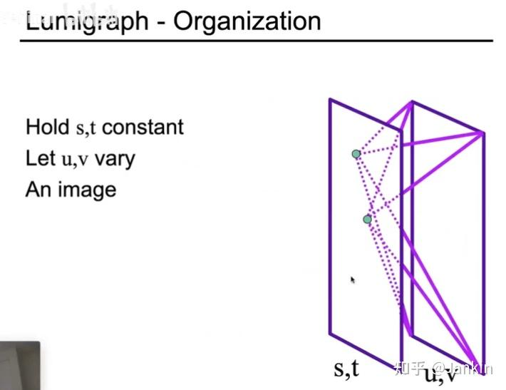
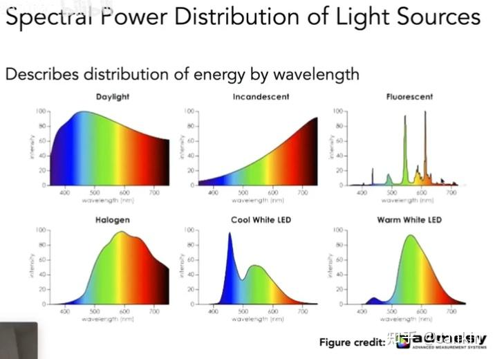
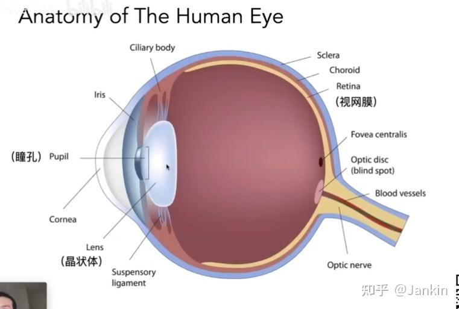
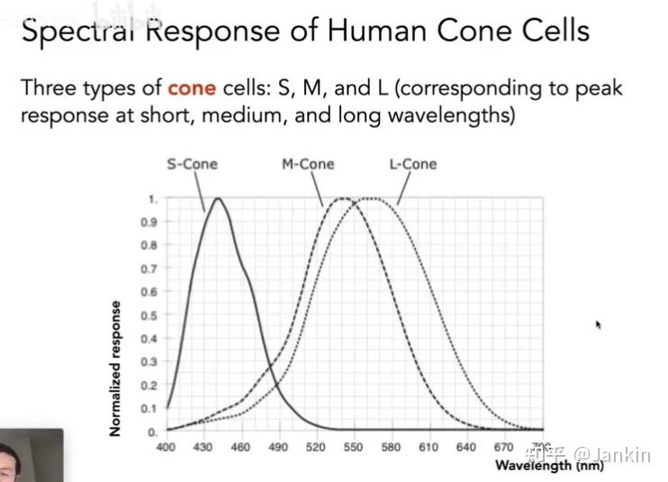
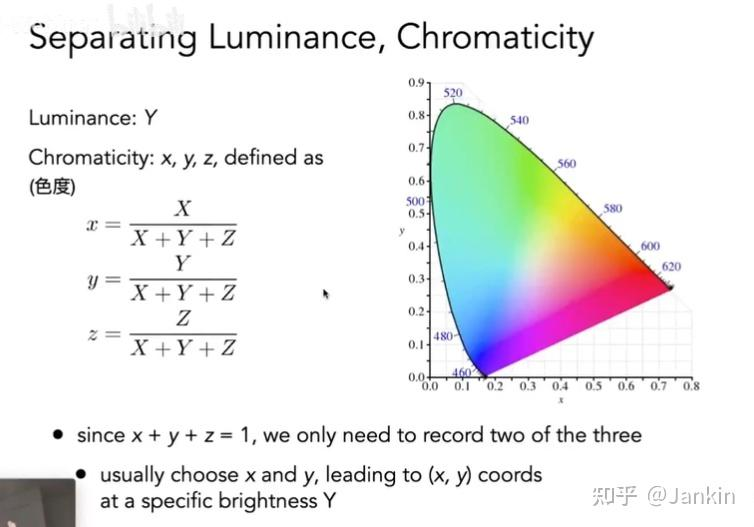

# 
 Lecture 20 Note
## 一、 光场 (Light Field / Lumigraph)
光场是一种记录和重现三维世界中所有光线信息的技术，让我们能从任意视点观察场景。

### 1. 全光函数 (The Plenoptic Function)
为了描述我们能看到的一切，科学家提出了全光函数的概念。这是一个终极的7维函数：
$$
P(θ,ϕ,V_x,V_y,V_z,t,λ)
$$
其中：
- $(θ,ϕ)$ 是观测方向的球面坐标。
- $(V_x,V_y,V_z)$ 是空间中某一点的三维坐标。
- $t$ 是时间。
- $λ$ 是光的波长。

全光函数描述了在任意位置 ($V_x, V_y, V_z$)、任意时间 ($t$)，朝任意方向 ($θ,ϕ$) 观测到的，由不同波长 ($λ$) 的光所构成的图像。该函数理论上完美但极其复杂。

### 2. 光场的简化与参数化

由于全光函数过于复杂，实际应用中通常使用光场的简化版本:
1. **忽略时间 $t$ 和波长 $λ$**: 假设场景是静态的，并且只考虑光的亮度（灰度），函数降为5维，描述了空间中任意一条光线：$P(θ,ϕ,V_x ,V_y ,V_z)$，即三维位置 + 二维方向;
2. **假设光在真空中沿直线传播**: 在这种情况下，一条光线上的光强是恒定的。我们不需要知道光线上的每一点，只需要定义这条直线本身。因此，5维函数可以进一步降为4维，这就是**光场或Lumigraph**。

### 3. 双平面参数化 (Two-Plane Parameterization)

双平面参数化 (Two-Plane Parameterization) 是定义4D光场最经典的方法
- **设置**: 想象在场景物体前放置两个平行的平面，一个uv平面和一个st平面。

- **定义光线**: 任何一条从uv平面穿过st平面的光线，都可以由它在这两个平面上的交点唯一确定，即 $(u,v) 和 (s,t)$。

- **4D光场函数**: 因此，光场可以表示为 $L(u,v,s,t)$，它记录了由这四个参数定义的每条光线的光强（或颜色）。

### 4. 光场的理解与应用
- **固定 (s, t)，遍历 (u, v)**: 如果我们固定st平面上的一个点，然后记录下所有穿过该点并与uv平面相交的光线，这等价于什么？这其实就相当于在 (s,t) 点放置了一个**针孔相机**，uv平面就是它的成像平面。我们得到的是一张从 (s,t) 点观察场景的**图像**。

- **光场相机 (Lytro)**: 现实中的光场相机，在主镜头后面、传感器前面放置了一个**微透镜阵列 (Microlens array)**。

    - **原理**: 每个微透镜都相当于st平面的一个点，而它后面覆盖的一小块像素区域则相当于uv平面。这样，相机传感器记录的不再是单个像素的颜色值，而是记录了穿过每个微透镜的、来自不同方向的光线信息。

    - **应用**: 因为记录了光线的方向信息，光场相机可以实现“先拍照，后对焦”的计算重聚焦 (Computational Refocusing) 功能。通过算法选择性地只使用那些对应于某个特定对焦平面的光线，就可以在后期生成任意对焦点的清晰图像。

    - **权衡 (Trade-off)**: 光场相机的代价是空间分辨率的降低。因为传感器上的一部分像素被用来记录方向信息，所以最终生成的图像在空间维度上的像素数会低于传感器的物理像素数。

## 二、 颜色的物理基础
颜色并非物体固有的**物理属性**，它源于光，并由我们的**视觉系统**进行解读。

### 1. 光的本质
光是一种电磁波。人眼能感知到的部分称为可见光，其波长范围大约在 400nm (紫) 到 700nm (红) 之间。

### 2. 谱功率密度 (Spectral Power Distribution - SPD)
SPD是描述光源物理属性的关键概念。它是一个函数，表示一个光源在每个波长上所含有的能量（或功率）。

- 太阳直射光: 其SPD曲线则相对平滑，且能量随波长增加而增加。

- 日光灯 vs LED灯: 它们的SPD曲线都呈“锯齿状”，与平滑的日光SPD截然不同。这解释了为什么在不同灯光下物体的颜色看起来会不一样。

### 3. 颜色感知 (Color Perception)
#### 3.1 人眼的生物结构

人眼像一台相机，视网膜 (Retina) 是传感器。视网膜上有两种感光细胞：

- **视杆细胞 (Rods)**: 对光非常敏感，在弱光环境下（如月光下）工作，但无法分辨颜色，只能感知明暗。

- **视锥细胞 (Cones)**: 在正常光照下工作，负责感知颜色。

人类有三种视锥细胞，它们对不同波长的光有不同的敏感度（响应曲线）：

- **S-Cones**: 对短波长光（蓝色区域）最敏感。

- **M-Cones**: 对中等波长光（绿色区域）最敏感。

- **L-Cones**: 对长波长光（红色区域）最敏感。

#### 3.2 感知过程
我们的大脑无法获知进入眼睛的光线完整的SPD曲线。而是只接收到由三种视锥细胞分别产生的三个信号值：$S、M、L$。

$$
S=∫s(λ)r_S(λ)dλ \quad
M=∫s(λ)r_M(λ)dλ \quad
L=∫s(λ)r_L(λ)dλ
$$
其中，s(λ) 是光源的SPD，r_S(λ)、r_M(λ)、r_L(λ) 分别是三种视锥细胞的响应曲线。

#### 3.3 同色异谱 (Metamerism)
同色异谱是指不同的光源可能具有完全不同的SPD曲线，但在视觉上却被感知为相同的颜色。
这是因为人眼只感知到三种颜色的强度，而不是光的完整的光谱分布。

- **示例**: 显示器发出的黄光（由红色和绿色像素混合而成，SPD在红绿波段有两个峰值）和太阳光谱中的纯黄光（SPD在黄色波段有一个平滑的峰值），它们的SPD天差地别，但都可以被我们感知为“黄色”。这是所有彩色显示设备能够工作的基本原理。

## 四、 颜色空间 (Color Spaces)

### 1. 加色系统与RGB颜色匹配 (Additive Color & RGB Matching)
显示器、投影仪等发光设备使用的是加色系统。最典型的就是RGB系统，它通过混合不同强度的红(R)、绿(G)、蓝(B)三种主色 (Primaries) 来生成各种颜色。

**颜色匹配实验 (Color Matching Experiment)** 是理解颜色空间的基础。

- **实验设置**:观察者面对一个被一分为二的屏幕。一边显示一个待匹配的**测试光 (Test light)**，另一边由红、绿、蓝三种主色光源混合而成。观察者需要调整R, G, B的亮度，直到混合光的颜色与测试光完全一致。

- **“负色”问题**: 实验发现，某些高饱和度的测试色（例如纯青色），无论如何都无法用R, G, B三色光相加得到。解决方法是，将三种主色中的一种（例如红色）加到测试光那边，去“降低”测试光的饱和度，直到它能被剩下的两种主色（绿色和蓝色）混合匹配。在数学上，这被记为该主色（红色）的量为负值。

- **CIE RGB 颜色匹配函数**: 为了标准化，CIE规定了一套标准的颜色匹配实验。

    - **主色**: 采用三种特定的单色光作为主色：700nm (R), 546.1nm (G), 435.8nm (B)。

    - **测试光**: 依次使用从400nm到700nm的各种单色光作为测试光。

    - **结果**: 实验得到三条**颜色匹配函数**曲线$\bar r(\lambda), \bar g(\lambda), \bar b(\lambda)$。这组函数描述了需要多少份量的标准R, G, B主色，才能匹配波长为 $λ$ 的单位能量的纯色光。

- **应用**: 一旦有了这组匹配函数，我们就可以计算出任何一个具有SPD s(λ) 的光源所对应的RGB值：

$$
R=∫s(λ)\bar r(λ)dλ \quad
G=∫s(λ)\bar g(λ)dλ \quad
B=∫s(λ)\bar b(λ)dλ
$$

这为所有颜色相关的计算和设备校准提供了理论基础。

### 2. CIE XYZ: 一个标准的颜色空间
由于CIE RGB匹配函数存在负值，使用不便，CIE进一步定义了 CIE XYZ 颜色空间。它基于三个虚拟的、不存在的“主色”X, Y, Z，其对应的颜色匹配函数  $\bar x(λ), \bar y(λ), \bar z(λ)$ 都是非负的。

- **Y通道**: 被特意设计为与人眼感知的**亮度 (Luminance)** 相对应。

### 3. CIE 色度图 (Chromaticity Diagram)
为了在2D平面上可视化颜色，人们将XYZ值归一化，得到色度坐标：
$$
x = \frac{X}{X + Y + Z}, \quad y = \frac{Y}{X + Y + Z}, \quad z = \frac{Z}{X + Y + Z}
$$
因为 $x+y+z=1$，我们只需要 $(x,y)$ 两个坐标就可以定义一种颜色（不考虑其亮度）。将所有可见色的 (x,y) 坐标绘制出来，就得到了马蹄形的**CIE色度图**。

- **边界 (光谱轨迹)**: 图的弧形边界代表了最高饱和度的光谱色（单色光）。

- **内部**: 越靠近中心，颜色饱和度越低。中心点是白色。

### 4. 互补色与视觉恒常性
- **互补色 (Opponent Colors)**: 人的视觉系统以“红-绿”、“蓝-黄”这样的对抗方式处理颜色。人们无法想象“带红色的绿色”，但可以想象“带红色的黄色（橙色）”。

- **视觉恒常性**: 笔记最后的棋盘阴影错觉图表明，我们对颜色的感知是相对的，会受到周围环境（如光照、阴影、邻近颜色）的强烈影响。大脑会自动“补偿”它认为的光照变化，导致我们对物体的绝对颜色做出错误的判断。