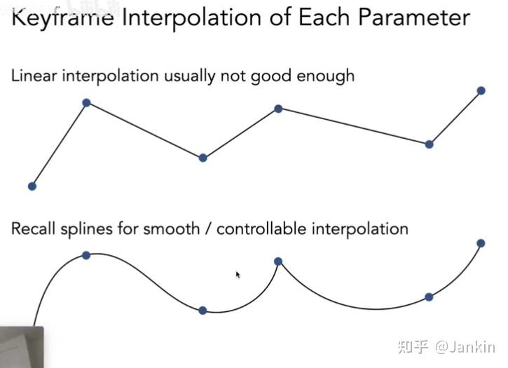
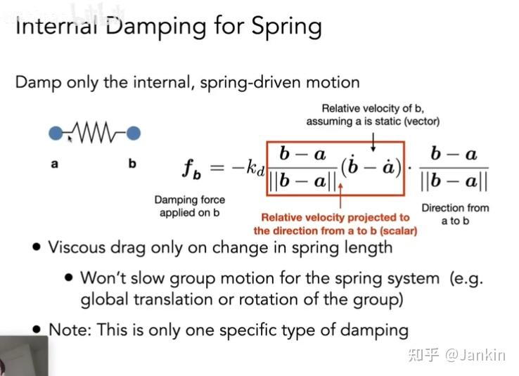
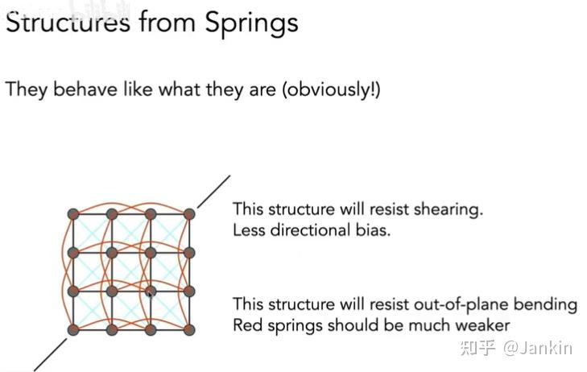
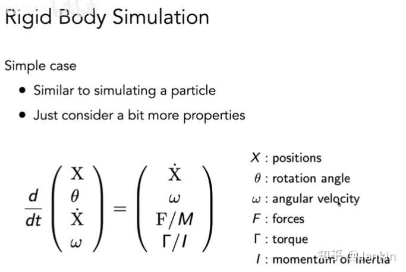

# 
 Lec 21 Note
动画通过连续播放一系列图像，在时间维度上扩展了静态的建模与几何，从而创造出运动的"幻觉"。

- **帧率 (Frame Rate)**: 动画的流畅度由帧率决定。电影通常是24fps，视频是30fps，而为了避免眩晕，虚拟现实(VR)则要求高达90fps以上。

## 一、 关键帧动画 (Keyframe Animation)
最基础也是最核心的动画制作方法，其流程源自传统手绘动画。

### 1. 核心思想
动画师（或主创）只负责创作出动作序列中最具代表性的、起决定性作用的画面，这些画面被称为**关键帧 (Keyframes)**。

### 2. 中间帧 (In-betweens / "Tweens")
关键帧之间的过渡画面，则由助手或计算机自动生成。这个自动生成的过程称为 **“补间动画 (Tweening)”**。

### 3. 插值 (Interpolation)
在计算机动画中，每个可动物体的状态（如位置、旋转、大小）都可以被看作一个参数。从一个关键帧到另一个关键帧的**过渡**，本质上就是对这些参数进行**插值**。

- **线性插值**: 最简单但效果通常不佳，会产生机械、生硬的变速。

- **样条插值** (Spline Interpolation): 如之前课程的贝塞尔曲线等，可以生成平滑且可控的过渡，是现代动画软件中的常用方法。
  

    
  

## 二、 物理模拟 (Physical Simulation)
与手动设置关键帧不同，物理模拟是让运动根据**物理规律**自动生成。其核心是牛顿第二定律：

$$
F=ma
$$

通过计算物体在每一时刻受到的合力 $F$，结合其质量 $m$，就可以得到其加速度 $a$，进而通过数值积分来更新物体在下一时刻的速度和位置，从而驱动动画。

### 1. 质点-弹簧系统 (Mass-Spring System)
这是构建可变形物体（如布料、头发）物理模型的一种常用方法。

- **基本结构**: 将物体离散化为一系列**质点 (Masses)**，并用**弹簧 (Springs)** 将它们连接起来。

- **弹簧力 (胡克定律)**: 弹簧产生的力与它被拉伸或压缩的长度成正比。对于连接质点 $a$ 和 $b$ 的弹簧，其作用在 $b$ 上的力为：

    $$
    f_{a\to b} = k_s \cdot \frac{b-a}{||b-a||} \cdot (||b-a|| - l)
    $$
    其中，
    - $k_s$ 是弹簧的劲度系数（Spring Constant），决定弹簧的刚性。
    - $l$ 是弹簧的自然长度（Rest Length），即未受力时的长度。

- **阻尼 (Damping)**: 如果只有弹簧力，系统会永无休止地振荡。为了让运动逐渐停止，需要引入阻尼力。

- **构建复杂结构** (以布料为例):

    - **结构弹簧 (Structural)**: 连接相邻的质点，维持布料的基本网格结构。但仅有这种弹簧，布料无法抵抗**切变 (Shearing)**。

    - **切变弹簧 (Shear)**: 在网格的对角线上添加弹簧。为了避免方向性的偏差（各向异性），通常会双向都添加。这样布料就能抵抗拉扯变形。

    - **弯曲弹簧 (Bend)**: 连接每隔一个的质点（如笔记中红色的线）。当布料弯曲时，这些弹簧会被拉伸，从而产生一个抵抗弯曲的力。这些弹簧的劲度系数通常设置得较弱。
    

    
    

### 2. 粒子系统 (Particle System)
这是一种模拟“模糊”或由大量**小单元**构成的现象（如烟、火、水、星系、鸟群）的强大技术。

- **核心**: 将系统建模为大量独立的粒子，每个粒子的运动由作用在其上的各种力决定。

- **动画循环**:

    1. （按需）生成新粒子。

    2. 计算每个粒子受到的合力（引力、斥力、阻尼、碰撞力等）。

    3. 更新每个粒子的速度和位置。

    4. （按需）移除生命周期结束的粒子。

    5. 渲染所有粒子。
实际上的挑战性远比上面的描述复杂。粒子系统通常需要处理大量的粒子，涉及到碰撞检测、群体行为（如鸟群、鱼群）等。

## 三、 运动学 (Kinematics)
运动学主要研究角色的骨骼运动，不考虑力。角色被抽象为一个由关节连接的骨架。

### 1. 正向运动学 (Forward Kinematics - FK)
- **问题**: 已知骨架中每个关节的角度，求骨架末端（如手或脚）的位置。
- **方法**: 这是一个直接的几何计算问题。从骨架的根部开始，逐个关节计算，通过一系列的旋转和平移变换，最终可以得到末端点的位置。
- **应用**: 动画师直接调节每个关节的角度来摆出想要的姿势。直观，但当骨骼链很长时，操作繁琐。

### 2. 反向运动学 (Inverse Kinematics - IK)
- **问题**: 已知骨架末端的**目标位置**，反向求解出骨架中每个关节应该转动的角度。
- **方法**: 这是一个更困难的非线性问题。

- **挑战**:
  - **多解性**: 达到同一个目标位置，可能有多种不同的姿势。
  - **无解性**: 目标位置可能超出了骨架的可达范围。

## 四、 绑定与动作捕捉
### 1. Rigging
**定义**: 为角色模型创建一套高层次的、直观的控制系统。这套系统就像木偶的提线，让动画师不必直接去操作模型的成千上万个顶点或骨骼，而是通过拖动几个**控制器**（Rigs）就能方便地摆出各种姿势和表情。

- **面部绑定**: 通过在脸上设置若干控制点，动画师可以轻松地制作出微笑、惊讶等复杂表情。

- **混合变形 (Blend Shapes)**: 另一种常用的面部动画技术。艺术家预先雕刻出几种基础表情（如开心、悲伤、愤怒），最终的表情则通过在这些基础表情模型之间进行线性插值得到。
### 2. 动作捕捉 (Motion Capture - Mocap)
**定义**: 一种数据驱动的动画方法。通过在真实演员身上放置标记点，用多个高速摄像机（通常是红外摄像机）捕捉这些标记点的三维空间运动轨迹，然后将这些运动数据应用到虚拟角色的骨架上。

- **优点**: 能够快速获取大量高度逼真的动作数据。

- **缺点**: 设备昂贵；捕捉到的数据可能需要后期调整才能满足艺术需求。

- **恐怖谷效应 (Uncanny Valley)**: 当一个虚拟角色在外观和动作上与真人“非常接近但又不完全一样”时，会引起观众的反感和恐惧。这是写实风格角色动画需要面对的一大挑战。阿凡达等电影通过精良的面部动作捕捉技术成功跨越了恐怖谷。

## 五、 模拟的数值解法
### 1. 问题定义：常微分方程 (ODEs)
一个粒子的运动可以由一个关于时间的一阶常微分方程(ODE)来描述：

$$
\frac{dx}{dt} = \dot{x} = v(x, t)
$$
这个方程表示，粒子位置的变化率（即速度）是其当前位置和时间的函数。我们的目标就是根据初始状态，一步步解出粒子在未来时间的位置。

### 2. 显式欧拉法及其问题 (Explicit Euler's Method)
显式（或前向）欧拉法是最简单的数值积分方法。它的思想为：假设在一个微小的时间步 $Δt$ 内，速度是恒定的，就用当前时刻的速度来估算下一时刻的位置。

$$
x^{t+Δt} = x^t + Δt \cdot v(x^t, t)
$$
**问题**:

- **不准确 (Inaccurate)**: 因为速度在 Δt 内实际上是变化的，这种估算会产生误差，并且误差会随着时间步的推进不断累积。时间步 Δt 越大，误差越大。

- **不稳定 (Unstable)**: 更严重的是，这种方法在很多情况下是**不稳定**的。例如，在模拟一个围绕中心点做圆周运动的粒子时，由于每一步的估算都是沿着当前点的切线方向前进，会导致粒子运动的轨迹不断**向外偏离**，能量不守恒，最终“飞出宇宙”。

### 3. 改进方法与稳定性

#### 3.1 中点法 (Midpoint Method)

- **思想**: 不直接用起始点的速度，而是用**时间步中点处**速度的估算值来推进。或者，综合考虑起始点和（估算的）终点的速度，取其**平均值**。

- **效果**: 这些方法通常比显式欧拉法更稳定，因为它们考虑了时间步内的速度变化，精度更高（误差阶数更小）。

#### 3.2 自适应步长 (Adaptive Step Size)

- **思想**: 动态地调整时间步 $Δt$ 的大小。在一个时间段 $T$ 内，分别用一步（大小为 $T$）和两步（大小为 $\frac{T}{2}$）进行计算，比较两个结果的差异。如果差异过大，说明此处的运动变化剧烈，就需要减小步长，用更精细的步长来计算，直到差异在可接受的阈值内。

- **效果**: 非常实用，可以在运动平缓时使用大步长以提高效率，在运动复杂时使用小步长以保证精度。

#### 3.3 隐式欧拉法 (Implicit Euler)

- **思想**: 与显式欧拉法相反，它用下一时刻的速度来更新当前位置：
  $$
  x^{t+Δt} = x^t + Δt \cdot v(x^{t+\Delta t}, t+\Delta t)
  $$
- **特点**: 这是一个隐式方程，因为未知量 $x^{t+Δt}$
  同时出现在等式的两边。求解它通常需要使用牛顿法等求根算法。

- **效果**: 计算成本更高，但非常稳定，即使在很大的时间步下也能保证模拟不会发散，特别适合模拟布料等需要高劲度系数的系统。

### 4. 龙格-库塔法 (Runge-Kutta Methods)

这是一种在数值分析中广泛使用的**高阶方法族**，特别擅长处理非线性问题，能提供很高的精度。

- **四阶龙格-库塔法 (RK4)**: 是其中最常用的一种，它通过在当前时间步内计算4个不同位置的“斜率”（即速度），然后对这4个斜率进行加权平均，来得到一个对下一步位置的非常精确的估算。

- **计算过程**: 假设要求解 $\frac{dy}{dt} = f(t,y)$，步长为$h$:
  1. 计算四个斜率：
     - $k_1 = h \cdot f(t_n, y_n)$（起始点的斜率）
     - $k_2 = h \cdot f(t + \frac{h}{2}, y + \frac{k_1}{2})$（用 $k_1$估算的中点位置的斜率）
     - $k_3 = h \cdot f(t + \frac{h}{2}, y + \frac{k_2}{2})$（用 $k_2$再次估算的中点位置的斜率，更精确）
     - $k_4 = h \cdot f(t + h, y + k_3)$ （用 $k_3$估算的终点位置的斜率）
  2. 更新位置：
     - $y_{n+1} = y_n + \frac{1}{6}(k_1 + 2k_2 + 2k_3 + k_4)$ 
  
  这个加权平均（中间的斜率权重更高）使得RK4的精度远高于简单方法。
### 5. 基于位置的方法 / Verlet 积分
这是一种在游戏和实时应用中非常流行的方法，其核心思想是**直接操控位置**，而非严格通过力来积分。

- **核心流程**:
  1. **预测位置**: 根据当前速度和位置，使用某种简单方法（如欧拉积分）预测粒子在下一步的临时位置。
  2. **检查约束**: 检查这个临时位置是否违反了某些**约束 (Constraints)**。例如，在布料模拟中，约束可以是“任意两个相连的粒子间距离不能超过弹簧原长的一定比例”。
  3. **修正位置**: 如果违反了约束，就强行修正粒子的位置，使其满足约束。
  4. **反向计算速度**: 最后，根据粒子位置的实际变化（修正前后的位置差），反向计算出其速度。
- **优缺点**:
  - **优点**: 速度快，实现简单，并且因为总是强制满足约束，所以表现得非常稳定，不会出现“爆炸”或穿模等问题。
  - **缺点**: 它不是一个严格的物理模拟，在修正位置的过程中会引入或耗散能量，不满足能量守恒。

### 6. 应用扩展：刚体与流体模拟
这些针对单个粒子的数值求解方法，可以被扩展应用到更复杂的系统中。

#### 6.1 刚体模拟
 可以看作是单个粒子的扩展。除了要模拟其**位置 (X)** 和**线速度**之外，还需要额外考虑其**朝向 ($θ$)、角速度 ($ω$)、转动惯量 ($I$) 和受到的力矩 ($Γ$)**。它的状态更新方程会同时包含线性和旋转两部分的运动。
 

#### 6.2 流体模拟 (基于位置):

- **模型**: 将水等流体看作是由大量不可压缩的、微小的刚体小球（粒子）组成的。

- **核心思想**: 核心约束是**密度恒定**。在模拟的每一步中，如果发现某个区域的粒子密度变得过高（被压缩）或过低（被拉伸），系统就需要移动该区域内的粒子，直到密度恢复到预设的正常值。

- **求解**: 这个“修正”过程可以通过**梯度下降**来完成。系统会计算出密度相对于每个粒子位置的梯度，然后让粒子沿着能最快使密度恢复正常的梯度方向移动。

#### 6.3 物质点法 (Material Point Method - MPM):

这是一种先进的混合模拟方法，结合了 **拉格朗日法(粒子法)和欧拉法(网格法)** 的优点。

- **拉格朗日视角**: 场景中的物质（如雪、沙、水）由一系列携带物理属性（如质量、速度）的粒子来表示。这善于处理物质的大形变。

- **欧拉视角**: 同时，空间被划分为一个固定的背景网格。复杂的计算（如压力求解、碰撞检测）在网格上进行，这比直接计算粒子间的相互作用更高效、更稳定。

- **核心流程**:
  
  1. **粒子到网格 (P2G)**: 在每个时间步开始时，粒子将自己的质量、速度等信息“转移”到周围的网格节点上。

  2. **网格计算**: 在网格上求解运动方程，更新网格节点的速度。

  3. **网格到粒子 (G2P)**: 网格节点再将更新后的信息“插值”回粒子身上，更新粒子的位置和速度。
