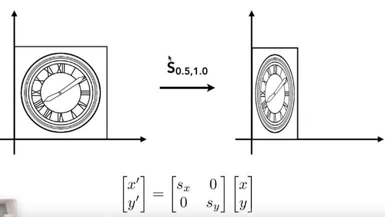
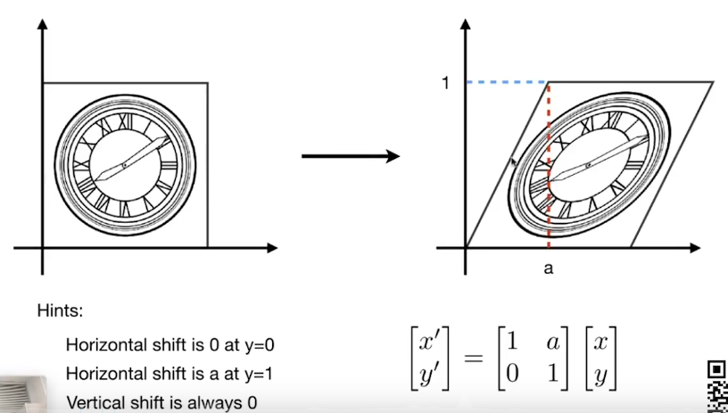
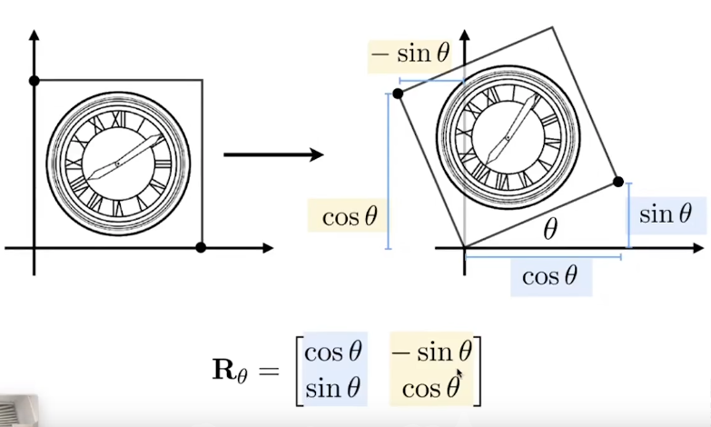
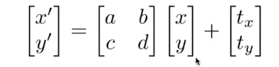
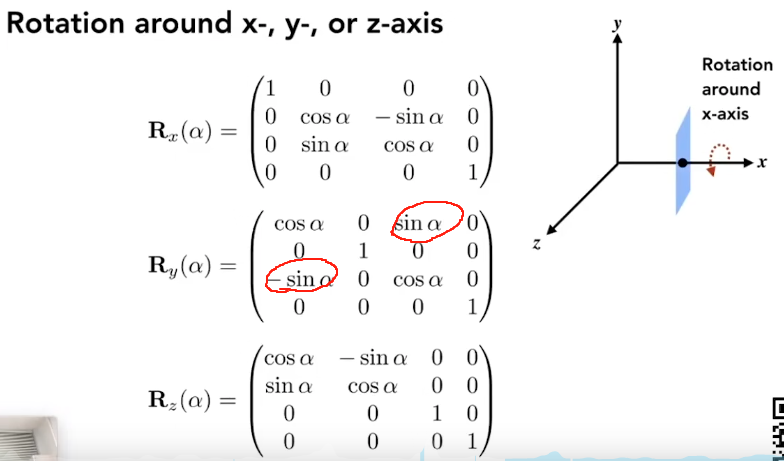
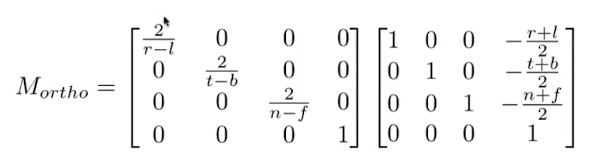
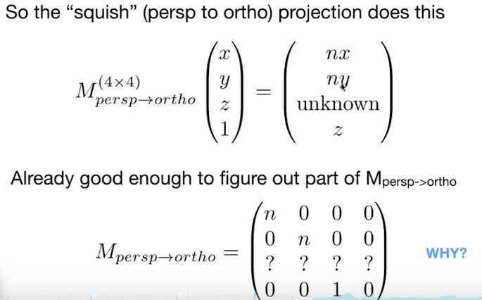
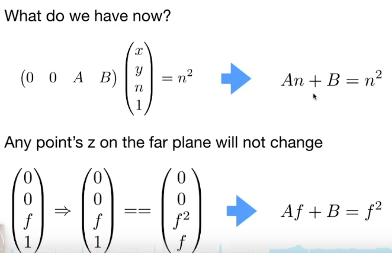

# 
  Lecture 03 04 Notes

## 基础（仿射）变换
### 1. 缩放变换

### 2. 切变变换

### 3. 旋转变换

### 4. 平移变换（非线性）

## 齐次坐标系
    1. n 维的点/向量，用 n+1 维的向量来表示。点的最后一维为1，向量的最后一维为0
    2. 变换用n+1维的方阵左乘向量来表示。矩阵的顺序十分关键，越先进行的变换，越靠近向量。
    3. 逆变换对应于逆矩阵。( 旋转操作中, $R_\alpha^{-1} = R_\alpha^T = R_{-\alpha}$ )

## 三维变换
### 1 平移缩放变换
    和二维情况基本相同

### 2. 旋转变换

    公式为：$$ \mathbf{R}(\mathbf{n}, \alpha)=\cos (\alpha) \mathbf{I}+(1-\cos (\alpha)) \mathbf{n} \mathbf{n}^{T}+\sin (\alpha)\left(\begin{array}{ccc} 0 & -n_{z} & n_{y} \\ n_{z} & 0 & -n_{x} \\ -n_{y} & n_{x} & 0 \end{array}\right) $$

## 视图变换（Important！）
### 1. 视图/相机变换
    将一个三维物体变为二维照片
    确定相机（View）的三个向量：position, gaze direction, up direction
    约定俗成：面朝-z方向，向上y方向
    相机和物体相对静止即可，故会把相机变换到原点位置，先平移再旋转，求旋转方向时可以先求逆矩阵

### 2. 投影
#### 1. 正交投影
        把任意一个几何体映射到一个[-1, 1]的标准立方体中，然后去掉z轴

#### 2. 透视投影
        平行->不平行
        已知在齐次坐标系中，(x,y,z,1)乘上系数k(k≠0)，表示的点不变
        投影可以理解为，先把透视投影远的那一面挤压到和近的那一面一样大，然后进行水平投影
        挤压过程中：1. 近平面不发生变化；2. 远平面z坐标a不变；3. 远平面中心点不变

