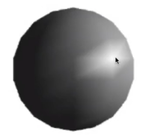
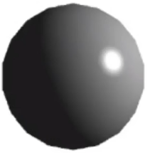
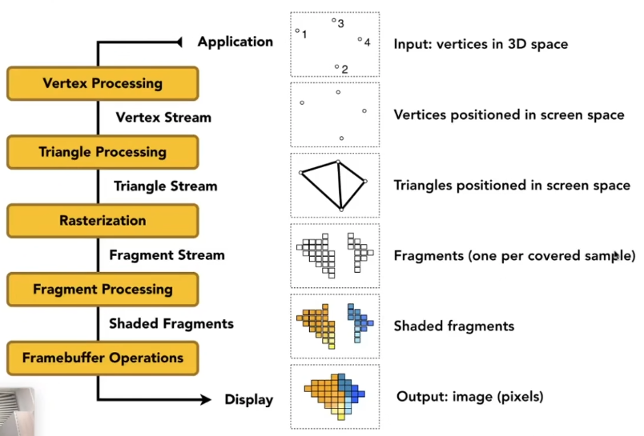

# 
 Lecture 8 Note

## 一、 Blinn-Phong 反射模型 (续)
上一次课程学习了漫反射，本次课程将补全Blinn-Phong模型的另外两个组成部分：高光和环境光。

### 1. 高光 (Specular Term)
高光模拟的是光滑表面上类似镜面反射的明亮光斑，它的强度与观察方向密切相关。

- **核心思想**: 当观察方向 $\hat{v}$ 与完美镜面反射方向 $\hat{R}$ 非常接近时，我们能看到高光。然而，计算 $\hat{R}$ 比较复杂。

- **Blinn-Phong 优化**: 引入一个计算更简单的**半程向量 (halfway vector) $\hat{h}$**。

    $$
    \hat{h} = \frac{\hat{l} + \hat{v}}{|\hat{l} + \hat{v}|}
    ​$$
 
    当半程向量 $\hat{h}$ 与表面法线 $\hat{n}$ 非常接近时，其效果等价于 $\hat{v}$ 与 $\hat{R}$ 接近。

- **高光公式**
    $$L_s = k_s \cdot \left(\frac{I}{r^2}\right) \cdot \max(0, \hat{n} \cdot \hat{h})^p$$

    其中：
    
    - $L_s$: 高光项的颜色与强度。
    
    - $k_s$: **高光系数 (specular coefficient)**，通常是一个白色或灰色值，代表材质的高光反射能力。
    
    - $\hat{n} \cdot \hat{h}$: 判断半程向量与法线的接近程度。
    
    - $p$: **高光指数** (shininess)，一个非常重要的参数。$p$ 值越高，$\cos\alpha$ 的衰减越快，高光范围就越小、越集中，表面看起来就越光滑。通常取值为100-200。

### 2. 环境光 (Ambient Term)
环境光用于模拟来自环境的间接光照，以确保场景中的阴影部分不是纯黑色。

- **核心思想**: 这是一个非常粗略的近似，它假设任何一个点接收到的环境光在所有方向上都是完全相同的，是一个与法线、视角、光照方向都**无关**的常量。

- **环境光公式**:

  $$L_a = k_a \cdot I_a$$
  其中：
  - $L_a$: 环境光项的颜色与强度。
  - $k_a$: 环境光系数 (ambient coefficient)，通常是一个较暗的颜色值。
  - $I_a$: 环境光强度，通常是一个全局的光源强度。

### 3. Blinn-Phong 模型汇总
将漫反射、高光、环境光三项相加，就得到了完整的Blinn-Phong反射模型：
$$L = L_a + L_d + L_s = k_a \cdot I_a + k_d \cdot (\frac{I}{r^2}) \cdot max(0, \hat{n} \cdot \hat{l}) + k_s \cdot \left(\frac{I}{r^2}\right) \cdot \max(0, \hat{n} \cdot \hat{h})^p$$
 
## 二、 着色频率 (Shading Frequencies)
“在什么粒度上执行上述光照计算”会极大地影响渲染效果和性能。主要有三种频率：

### 1. 逐面着色 (Flat Shading):

- **做法**: 对每个三角形计算一次光照，然后用这个单一的颜色填充整个三角形。

- **效果**: 表面呈现出明显的块状，适用于风格化的低多边形（Low-Poly）艺术风格，不适合表现光滑曲面。
- **示例效果如下**:
  
    

### 2. 逐顶点着色 (Gouraud Shading):

- **做法**: 在每个顶点上计算其法线，并执行一次完整的光照计算得到顶点的颜色。三角形内部像素的颜色由三个顶点的颜色通过插值得到。

- **效果**: 效果比Flat Shading平滑很多，但可能会丢失一些高光细节（例如，一个高光可能正好出现在三角形内部，而不是顶点上）。
- **示例效果如下**:
  
    

### 3. 逐像素着色 (Phong Shading):

- **做法**: 在每个顶点上计算法线，然后通过插值得到三角形内部每一个像素的法线向量。最后，在每个像素上都执行一次完整的光照计算。

- **效果**: 效果最平滑、最精确，是现代实时渲染的标准做法。
- **示例效果如下**:
  
    

- **注意**: 不要将 Phong Shading (着色频率) 与 Blinn-Phong Model (反射模型) 混淆。前者是一种插值方法，后者是一个光照公式。

### 4. 如何定义顶点法线？
- **理想情况**: 如果模型本身就是由光滑的解析几何（如球体）生成的，可以直接得到每个顶点的精确法线。

- **通用方法**: 对于一个三角网格（Mesh），一个顶点的法线可以通过加权平均(或简单平均)其周围所有共享该顶点的面的法线来得到。

## 三、 实时渲染管线与可编程着色器
### 1. 图形管线 (Graphics Pipeline) 概览

这是一个将三维模型数据最终转换成屏幕二维图像的一系列处理步骤。主要流程如下：\
顶点输入 -> 顶点处理 (Vertex Processing) -> 三角形处理 -> 光栅化 (Rasterization) -> 片元处理 (Fragment Processing) -> 帧缓冲操作 (Framebuffer Operations) -> 显示

- **顶点处理**: 主要进行MVP变换。

- **光栅化**: 进行采样和深度测试（Z-Buffering）。

- **片元处理**: 进行着色计算。

### 2. 可编程着色器 (Shaders)
现代GPU允许开发者通过编写小程序来控制渲染管线中的特定阶段，这些小程序就是**着色器 (Shader)**。

- **顶点着色器 (Vertex Shader)**: 运行在每个顶点上，主要负责顶点的空间变换。

- **片元着色器 (Fragment/Pixel Shader)**: 运行在每个片元（潜在的像素）上，主要负责计算颜色，实现光照模型。

## 四、 纹理映射 (Texture Mapping)
Blinn-Phong模型中的 kd 等系数对于整个物体是统一的，这无法表现物体表面丰富的细节。纹理映射就是为了解决这个问题。

### 1. 为什么需要纹理？
纹理映射允许我们将一张2D图片（纹理）“贴”到3D模型的表面，从而让模型表面的每一个点都可以拥有不同的属性（如颜色、粗糙度、法线等）。

### 2. 纹理坐标 (UV Coordinates)
为了建立3D表面点与2D纹理图点之间的映射关系，我们为模型的每个顶点都指定一个纹理坐标 (u, v)。

- u 对应纹理图的横轴，v 对应纵轴。

- UV坐标通常被定义在 [0, 1] 的范围内。