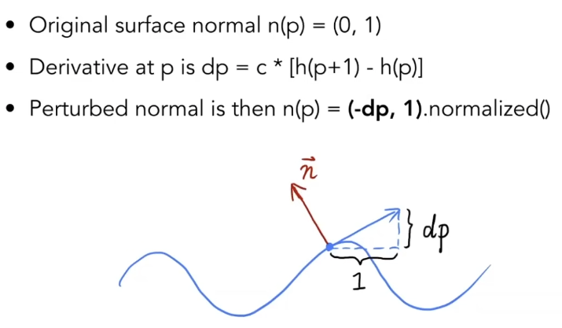
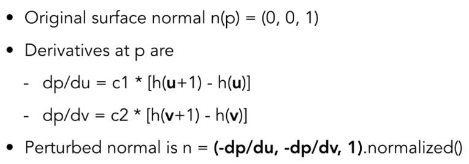

# 
 Lecture 9.5 Note

## 一、 纹理：不止于颜色
在之前的课程中，纹理主要用来定义物体表面各点的漫反射颜色$k_d$。然而，纹理的本质是一块可供我们灵活查询的内存，因此它可以用来存储任何我们想要的表面属性，从而实现远超简单贴图的丰富视觉效果。\
纹理在以下几个方面的有很高级的应用：

- **环境光照贴图 (Environment Mapping)**

- **改变表面外观 (凹凸/法线贴图)**

- **改变真实几何 (位移贴图)**

- **其他应用**

## 二、 环境光照贴图 (Environment Map)
Blinn-Phong模型中的环境光项 $ka * Ia$ 是一个非常粗糙的、全局统一的常量，这显然不真实。环境贴图提供了一种更真实地模拟环境光照和物体表面反射的方法。

- **核心思想**: 将整个场景周围的环境光信息预先捕捉并存储在一张纹理上。当渲染一个光滑或镜面物体时，我们可以根据其表面的反射方向，去这张环境贴图上查询对应的光照颜色，从而模拟出反射周围环境的效果。

- **基本假设**: 环境光来自于一个无限远处的球面或立方体，因此反射**只与方向有关**，与物体在场景中的**具体位置无**关。

### 1. 球面贴图 (Spherical Map)
一种早期的实现方式，将环境信息记录在一个球面上，然后像展开世界地图一样展开成一张2D纹理。

- **问题**: 这种方法会在贴图的顶部和底部（两极）产生严重的**图像扭曲和拉伸**，影响反射的质量。

### 2. 立方体贴图 (Cube Map)
这是现代图形学中实现环境映射的标准和更优的解决方案。

- **核心思想**: 想象一个巨大的立方体将整个场景包裹起来，我们将环境从六个方向（前、后、左、右、上、下）分别投影到立方体的六个内表面上，形成六张独立的方形纹理。

- **采样方法**:

    - 计算出从相机出发，经过物体表面某点反射后的反射光线方向向量 $\vec{r}$。

    - 根据向量 $\vec{r}$ 的方向，判断它将射向这个虚拟立方体的哪一个面。

    - 利用向量 $\vec{r}$ 的另外两个分量，计算出它在该面上的具体 $(u,v)$ 坐标。

    - 查询该面纹理上对应坐标的颜色。

- **优点**: 相比球面贴图，立方体贴图的扭曲小得多，能提供更高质量的环境反射效果。

## 三、 凹凸贴图与位移贴图
对于一个低多边形模型，我们如何在不增加顶点数量的前提下，让它看起来充满丰富的几何细节？答案是通过贴图来 **“欺骗”光照计算**。

### 1. 凹凸贴图 (Bump Mapping)
- **核心思想**: 凹凸贴图本身是一张灰度图，也叫高度图 (Height Map)。它<u>**并不直接改变模型的几何形状**</u>，而是通过存储每个纹理像素的相对高度信息，在着色时<u>动态地计算出该点被扰动后的**法线方向**</u>，从而影响光照计算，产生凹凸不平的视觉效果。

- **法线扰动计算**:

    - 在一个以原始法线 n 为Z轴的局部坐标系（切线空间）中，原始法线可以表示为 (0, 0, 1)。

    - 通过计算高度图中 u 和 v 方向上高度的变化率（即导数 $\frac{dp}{du}$ 和 $\frac{dp}{dv}$），我们可以得到该点表面的局部切线方向。

    - 新的、被扰动后的法线就垂直于这个新的切平面。在局部坐标系中，它可以近似为 $n_{perturbed} = (-dp/du, -dp/dv, 1)$，最后再进行归一化。

    - 这个在局部坐标系下计算出的新法线，需要通过一个变换矩阵（TBN矩阵）转换回世界空间，才能参与后续的光照计算。
    - 二维情况：\
        
    - 三维情况：\
        

- **法线贴图 (Normal Mapping)** \
  是凹凸贴图的直接演进。它不再存储高度信息，而是直接将预计算好的、扰动后的法线向量的 (x, y, z) 方向信息作为RGB颜色值存储在一张贴图中。这样做省去了在着色器中通过导数计算法线的步骤，效率更高。

### 2. 位移贴图 (Displacement Mapping)
位移贴图是比凹凸/法线贴图更进一步的技术，它不再是“欺骗”光照，而是真实地改变了模型的几何形状。

- **核心思想**: 与凹凸贴图一样，它也使用一张高度图。但它是在渲染前，根据高度图的值，实际地移动模型上每一个顶点的位置。

- **与凹凸贴图的关键区别**:

    1. **几何轮廓**: 位移贴图会改变模型的轮廓和剪影，而凹凸贴图的轮廓依然是原始低多边形的光滑轮廓。

    2. **自遮挡与阴影**: 由于顶点位置被真实改变，位移贴图可以产生正确的自遮挡和自阴影效果，而凹凸贴图无法做到。

    3. **要求与代价**: 位移贴图要求模型本身具有非常高的顶点密度（细分程度），否则没有足够的顶点可供位移，效果会很差。因此，它的计算和内存开销远大于凹凸贴图。

## 四、 纹理的其他应用
纹理可以被看作一个通用的“数据容器”。

### 1. 预计算着色 (Precomputed Shading)
 我们可以将一些复杂的、静态的光照计算结果提前烘焙到一张纹理上。一个典型的例子是**环境光遮蔽 (Ambient Occlusion, AO)** 贴图。它存储了模型表面各点被周围几何体遮挡的程度，用于在着色时给缝隙、角落等地方添加柔和的接触阴影，极大地提升了真实感。

### 2. 三维纹理 (3D Textures) 与体渲染 (Volumetric Rendering)
 纹理不一定是二维的。三维纹理可以定义空间中任意一点的属性。这使得我们可以表现“实心”的物体，如大理石、木纹等，或者用于医学领域的体渲染，将CT扫描得到的密度数据可视化为三维的骨骼或器官图像。