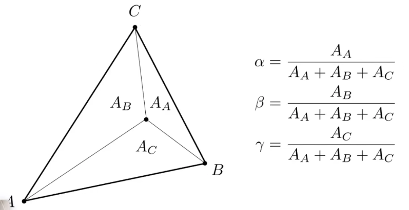

# 
 Lecture 9 Note

## 一、 插值的基石：重心坐标 (Barycentric Coordinates)
上一次课程中提到，要在三角形内部平滑地过渡顶点的属性（如颜色、法线、UV坐标），我们需要一个插值工具。这个工具就是重心坐标。

### 1. 定义
 三角形 ABC 内的任意一点 $(x,y)$ 都可以被唯一地表示为三个顶点 A, B, C 的一个**线性加权组合**：
$$
(x,y)=αA+βB+γC \\
α+β+γ=1
$$
其中，权重 $(α,β,γ)$ 就是该点的重心坐标
### 2. 几何意义

 重心坐标直观地代表了点与三个顶点之间的“亲近程度”。其值等于该点与另两个顶点组成的小三角形面积占总面积的比例。例如，$α$ 的值就是由点P和顶点B、C组成的三角形PBC的面积与大三角形ABC面积的比值。如果一个点P非常靠近顶点A，那么$α$的值就趋近于1，而$β$和$γ$则趋近于0。
$$
α= \frac{Area(PBC)}{Area(ABC)},
β= \frac{Area(PAC)}{Area(ABC)},
γ= \frac{Area(PAB)}{Area(ABC)}
​$$
 
### 3. 应用
 重心坐标是实现平滑插值的万能钥匙。一旦求出某像素中心的重心坐标，我们就可以用这同一组权重来插值**任何**定义在顶点上的属性 V：
$$
V_P = αV_A+βV_B+γV_C
$$
​
这里的 V 可以是位置、颜色、法线、深度、纹理坐标等任何需要在三角形内部平滑过渡的数据。

### 4. 关键问题
 在三维空间中计算出的重心坐标，在经过透视投影后会发生变化。这意味着，一个在3D空间中位于线段中点的点，投影到2D屏幕上后，不一定还在投影后线段的中点。因此，直接在屏幕空间对属性（尤其是UV坐标）进行线性插值会导致纹理扭曲等视觉错误。正确的做法是进行透视校正插值，这虽然超出了本次课程的范畴，但它是保证纹理贴图正确性的关键技术。

## 二、 纹理映射 (Texture Mapping)
纹理映射允许我们将一张2D图片（纹理, Texture）“贴”到3D模型表面，是极大地丰富物体表面细节、提升真实感的基础技术。流程如下：

  1. **UV展开**: 为模型的每个顶点都精心指定一个二维的纹理坐标 $(u,v)$。类似于将一个三维模型的表面“表皮”小心翼翼地剥下来，并摊平在一张2D画布上，这个画布就是纹理空间。

  2. **插值**: 对于光栅化后的每个像素，利用其重心坐标插值得到它在模型表面对应的 $(u,v)$ 坐标。

  3. **采样**: 使用这个插值得到的 $(u,v)$ 坐标，去2D纹理图上进行采样 (Sample)，也就是查询并获取该坐标点的颜色值。

  4. **应用**: 将获取到的颜色（texcolor）作为该点的一个局部材质属性（通常是漫反射系数 kd，但也可以是高光颜色、粗糙度等）代入光照模型进行最终的着色计算。

## 三、 纹理查询的问题与解决方案
在纹理采样时，屏幕像素和纹理像素之间的大小关系并非总是一一对应，这会引发两种主要问题：

### 1. 纹理放大 (Texture Magnification)
当观察者离物体表面很近时，一个屏幕像素 (pixel) 可能只覆盖了纹理图上一小片区域，甚至小于一个纹理像素 (texel)。此时就需要进行放大处理。

- **问题**: 如果处理不当，会导致图像出现明显的块状马赛克或不自然的模糊。

- **解决方案**:

  - **最近邻插值 (Nearest Neighbor)**: 最简单的方法，直接取 $(u,v)$ 坐标最接近的那个纹理像素的颜色。这种方法速度快，但效果粗糙，会产生明显的块状锯齿。

  - **双线性插值 (Bilinear Interpolation)**: 一种更平滑的方案。它会找到 $(u,v)$ 坐标周围的4个纹理像素，然后根据 $(u,v)$ 与这4个点的相对位置进行加权平均。这需要分三步完成：首先在水平方向上，对上下两对点分别进行线性插值(lerp)；然后，在垂直方向上，对前两步得到的结果再进行一次线性插值。效果比最近邻平滑得多。

  - **双三次插值 (Bicubic Interpolation)**: 考虑周围16个纹理像素，进行更高阶的插值。效果更平滑，但计算开销也相应增大。

### 2. 纹理缩小 (Texture Minification)
当物体距离观察者很远时，一个屏幕像素可能会覆盖非常大一片纹理区域。这是**更严重、也更常遇到**的问题。

- **问题**: 如果仍然只用像素中心点进行采样（Point Sampling），就相当于用一个样本去代表成百上千个纹理像素的信息，这会完全丢失被覆盖区域中的高频细节（如精细的图案），从而导致严重的走样——远处的地面或墙壁出现令人不适的摩尔纹和闪烁。

- **核心思路**: 正确的做法不是进行“点查询”，而是进行**范围查询 (Range Query)** 。我们需要计算出这个屏幕像素在纹理空间上对应的**足迹 (Footprint)**，并求出这个足迹区域内所有纹理像素的平均值**。

## 四、 范围查询技术：Mipmap
直接计算不规则“足迹”的平均值非常困难且耗时。Mipmap 是一种被广泛应用的快速、但有损的近似解决方案。

### 1. 创建 (Preprocessing)
 在渲染前，对原始纹理（Level 0）进行一系列处理，生成一个分辨率逐级减半的图像金字塔。Level 1是Level 0尺寸的一半，Level 2是Level 1的一半，以此类推，直到1x1像素的Level n。每一层更高层级的纹理像素都是由其下一层对应的2x2像素区域平均计算得来。整个Mipmap结构只会额外增加约 **1/3** 的存储开销。

### 2. 查询 (Querying)

- **计算Mipmap层级 D**: 估算屏幕像素的“足迹”有多大。一个简便的方法是，计算当前像素 $(x,y)$ 与其相邻像素 $(x+1,y)$ 和 $(x,y+1)$ 在纹理空间中的uv坐标变化率，取其最大值 L。L越大，说明纹理细节变化越快，需要的模糊程度越高。合适的Mipmap层级 $D = log₂(L)$。

- **在对应层级采样**: 在计算出的层级 D 上，使用插值后的 $(u,v)$ 坐标进行纹理查询。

### 3. Mipmap 的改进：三线性插值 (Trilinear Interpolation)
直接使用四舍五入的层级 D 会导致在不同Mipmap层级间切换时，画面出现明显的“跳变”现象。为了实现平滑过渡，我们采用三线性插值：

- 计算出连续的层级值 D (例如 D=1.8)。

- 在它两侧的整数层级，即 $floor(D)$ 层（第1层）和 $ceil(D)$ 层（第2层），分别进行一次双线性插值，得到两个颜色值。

- 最后，根据 D 的小数部分（0.8），对这两个颜色值再进行一次线性插值，从而得到一个在两层之间平滑混合的最终颜色。

### 4. Mipmap 的局限性
问题: Mipmap的核心假设是像素的“足迹”是一个正方形，因此它生成的图像金字塔都是正方形的（各向同性，Isotropic）。但在透视投影下，当我们以一个很小的角度（grazing angle）看向一个表面时（如远处的地面），像素的足迹通常是狭长的矩形或梯形。用一个大的正方形去近似一个狭长的矩形，会引入不必要的模糊，导致结果**过度模糊**，丢失了在一个方向上本应保留的细节。

## 五、 各向异性过滤 (Anisotropic Filtering)
各向异性过滤 是对Mipmap的重大改进，专门用于解决狭长足迹导致的过度模糊问题。“各向异性” (Anisotropic) 意味着“方向相关”，与Mipmap的“各向同性” (Isotropic) 形成对比。

### 1. 核心思想
 它不再只生成正方形的图像金字塔，而是会预计算并存储一系列在不同方向上被压缩过的纹理。例如，除了生成64x64, 32x32的版本，它还会生成64x32, 32x16, 16x64等不同宽高比的版本。

### 2. 查询
 在查询时，它可以根据像素足迹的形状（是横向拉长还是纵向拉长），智能地选择一个最匹配的、同样狭长的预计算纹理进行采样。

### 3. 效果
 能够极大地改善远处地面或墙壁的纹理清晰度，在保持抗走样效果的同时，还原了应有的细节。

### 4. 补充
EWA Filtering: 是一种更精确但开销也更大的技术，它尝试用多个椭圆来拟合不规则的像素足迹，以获得更准确的范围查询结果，属于更高级的研究范畴。