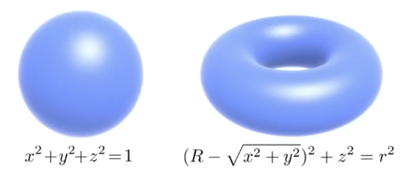
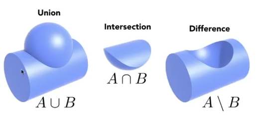
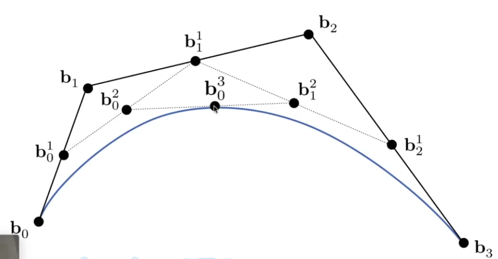
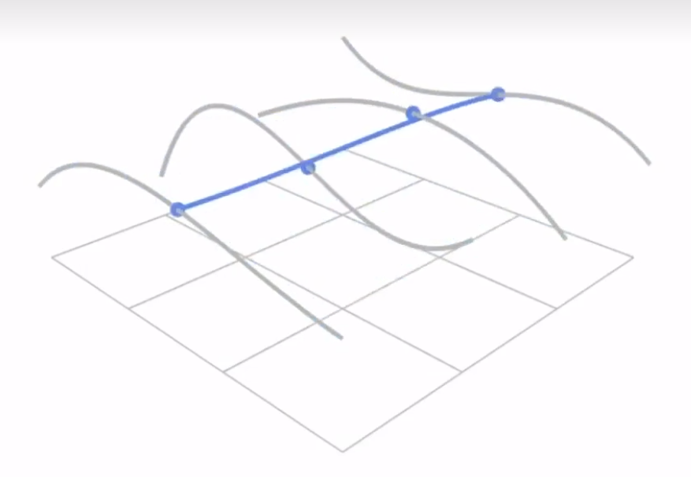
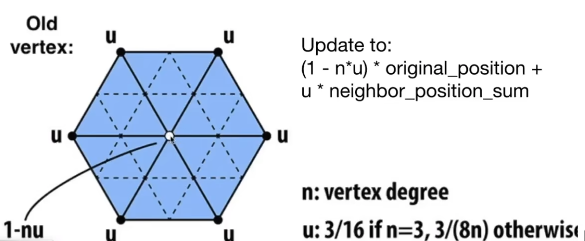
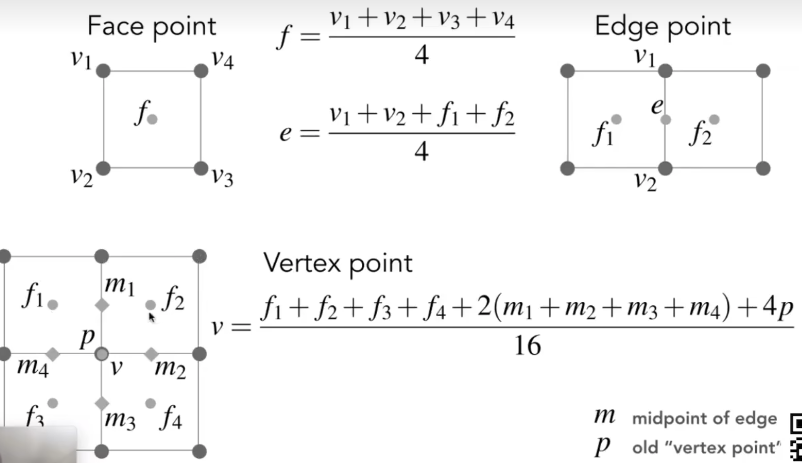

# 
 Lecture 10 11 Note

## 一、 如何在计算机中表示几何？
我们可以将几何体的表示方法分为两大类：**隐式表示 (Implicit Representations)** 和 **显式表示 (Explicit Representations)。**

| 
 表示方法 | 
 核心思想 | 
 例子 |
| --- | --- | --- |
| 隐式表示 | 通过一个函数或规则定义几何体的形状 | 代数曲面、构造实体几何、距离函数、水平集、分形 |
| 显式表示 | 直接列出几何体的顶点、边和面 | 点云、多边形网格 |

## 二、 隐式几何 (Implicit Geometry)
隐式几何的核心在于，它定义了一个函数 f(x, y, z)，通过判断函数值的正负来确定一个点与物体的关系：

- $f(x, y, z) = 0$: 点在物体表面上。

- $f(x, y, z) < 0$: 点在物体内部。

- $f(x, y, z) > 0$: 点在物体外部。

### 1. 代数曲面 (Algebraic Surfaces)
这是最直接的隐式表示，使用一个代数方程来定义几何表面。

- **示例**

    - 球面: $x^2 + y^2 + z^2 - r^2 = 0$

    - 环面 (Torus): $(R - \sqrt{x^2 + y ^2}) ^2 + z^2 - r^2 = 0$\
    
- **优点**

    - 判断内外关系非常容易：只需将点的坐标代入方程，看结果的正负即可。

    - 描述简单形状时，表达式非常紧凑。

- **缺点**

    - 很难直观地从一个复杂的方程想象出其对应的几何形状。

    - 难以表示如“奶牛”这样复杂的、没有简单数学表达式的物体。

### 2. 构造实体几何 (Constructive Solid Geometry, CSG)
CSG通过对简单的基础几何体（如球体、立方体、圆柱体）进行布尔运算（并、交、差）来组合成更复杂的物体。由于基础几何体通常是隐式定义的，所以CSG也属于隐式表示。

**布尔运算**:

- **并集 (Union)**: A∪B

- **交集 (Intersection)**: A∩B

- **差集 (Difference)**: A∖B\

### 3. 距离函数 (Distance Functions)
距离函数定义了空间中任意一点到物体表面的最短距离。通常我们使用**有向距离函数 (Signed Distance Function, SDF)**。

- **定义**\
   对于一个物体 $M$，有向距离函数 $d_M(x, y, z)$ 满足以下条件：

    - 点在物体外部时，$d_M(x, y, z) > 0$，表示到表面的距离。

    - 点在物体内部时，$d_M(x, y, z) < 0$，表示到表面的距离的相反数。

    - 点在表面上时，$d_M(x, y, z) = 0$。

- 优点:

  **平滑融合 (Blending)**: SDF的一个巨大优势是可以通过简单的数学运算（如加权平均）实现不同物体间的平滑、自然的融合效果，这是布尔运算难以做到的。这种技术被广泛用于创建有机、Q弹的融合形态。

### 4. 水平集 (Level Sets)
对于没有简单数学表达式的复杂形状（如医学扫描数据），我们可以用一种离散的方式来近似一个隐式函数。

- **核心思想**: 将空间划分为一个三维网格 (Grid)，并在每个网格点上存储一个标量值（例如，CT扫描中的组织密度）。

- **表面定义**: 物体的表面就是这些离散值通过插值后，等于某个特定阈值（“水平”）的<u>**等值面**</u>。这与地理学中的“等高线”思想非常相似。

- **应用**

    - 医学影像 (CT, MRI): 可视化具有相同组织密度的器官或骨骼表面。

    - 物理模拟: 模拟流体（如水花）的表面，水平集的值可以代表点到气液分界面的距离。

### 5. 分形 (Fractals)
分形是一种在不同尺度下都表现出自相似性的几何体。它们通常通过递归的、迭代的数学过程来定义，也属于隐式表示的一种。

### 6. 隐式几何的优缺点总结
- **优点**

    - 描述紧凑（一个函数或一组规则）。

    - 查询操作非常方便（如判断内外、计算距离）。

    - 非常适合光线追踪中的求交计算。

    - 对于简单形状，可以做到无误差的精确描述。

    - 易于处理拓扑结构的变化（如流体合并、分裂）。

- **缺点**

    - 对于复杂形状，难以直观地理解和设计。

    - 需要较高的数学基础来构建和操作。

    - 在渲染时，通常需要将隐式表示转换为显式表示（如三角网格）才能进行光栅化。

## 三、 显式几何 (Explicit Geometry)
与隐式几何通过关系定义不同，显式几何直接、明确地给出了构成几何体的点。

### 1. 点云 (Point Cloud)
- **定义**: 最简单的显式表示，就是一堆点的集合，每个点有其三维坐标 (x,y,z)。

- **来源**: 通常由三维扫描设备（如激光雷达）生成。

- **优点**: 能够轻松表示任意复杂的几何体。

- **缺点**: 点是离散的，点与点之间没有连接信息，这使得渲染（尤其是在欠采样区域）和几何处理变得困难。

### 2. 多边形网格 (Polygon Mesh)
多边形网格是图形学中最常用、最重要的显式表示方法。它不仅定义了**顶点的位置**，还定义了顶点之间的**连接关系**，形成了“面”。

- **组成**: 通常由顶点 (Vertices)、边 (Edges) 和面 (Faces) 组成。最常用的面是三角形或四边形。

- **.obj 文件格式**: 一种常见的、用于存储多边形网格的文本文件格式。它会分别列出所有顶点的位置 (v)、法线 (vn)、纹理坐标 (vt)，然后通过面的定义 (f) 将它们关联起来，指明哪个面由哪些顶点、法线和纹理坐标构成。

### 3. 曲线 (Curves) 与曲面 (Surfaces)

#### 1. 贝塞尔曲线 (Bézier Curves)
贝塞尔曲线通过一系列**控制点 (Control Points)** 来定义一条平滑的曲线。

   - **de Casteljau 算法 (几何画法)** \
这是一种通过递归线性插值来找到曲线上任意一点的直观方法。对于n+1个控制点，要找到参数t（t在[0,1]之间）对应的曲线上的点：

      1. 在每两个相邻的控制点 $P_i$ 和 $P_{i+1}$ 组成的线段上，找到一个按 t 比例插值的点。

      2. 将这些新生成的点连接起来，形成新的线段。

      3. 重复上述过程，直到最后只剩下一个点。这个点就是曲线上对应参数 t 的点。
   
   

   - **伯恩斯坦多项式(代数形式)** \
    任意一条由 n+1 个控制点 $b_i$ 定义的贝塞尔曲线，其上的点 $b(t)$ 都可以表示为这些控制点与伯恩斯坦多项式的加权和：
     $$
     b(t)= \sum_{i=0}^{  n} b_i B_{i}^n(t)
      $$
     其中，伯恩斯坦多项式为：
        $$B_{i}^n(t) = \binom{n}{i} t^i (1-t)^{n-i}$$
     其中 $\binom{n}{i}$ 是组合数，表示从 n 个元素中选取 i 个的方式数。
    这个多项式描述了在参数为 t 时，第 i 个控制点对曲线的“影响力”或权重。

   - **重要性质** 

      - **端点性 (Endpoint Property)**: 曲线的起始点和终点分别由第一个和最后一个控制点决定。

      - **切线方向**: 曲线在端点的切线方向由端点和其相邻控制点组成的线段决定。

      - **凸包性 (Convex Hull Property)**: 整条曲线一定完全包含在所有控制点形成的凸包（Convex Hull）之内。

      - **仿射变换不变性 (Affine Invariance)**: 对控制点进行**仿射变换**后再生成曲线，与先生成曲线再对曲线上每一点进行相同的仿射变换，结果完全相同。

   - **分段贝塞尔曲线 (Piecewise Bézier Curves)**\
高阶的贝塞尔曲线难以通过控制点进行直观的局部调整。在实践中，我们通常使用多段低阶（通常是三阶，即4个控制点）的贝塞尔曲线拼接而成。为了保证拼接处的平滑，我们需要确保连接点的连续性:

       - **C⁰ 连续**: 两段曲线的连接点重合。

       - **C¹ 连续**: 在C⁰的基础上，连接点两侧的切线方向相反且大小相等（即连接点和其左右两个控制点三点共线，且连接点是中点）。

#### 2. 贝塞尔曲面 (Bézier Surfaces)
贝塞尔曲面是将贝塞尔曲线的思想从一维扩展到二维的结果。

- **定义**: 一条贝塞尔曲线由一行控制点定义，而一个贝塞尔曲面则由一个控制点网格（例如4x4的网格定义一个双三次贝塞尔曲面）来定义。

- **de Casteljau 算法扩展**
我们可以将这个过程看作是在两个方向上分别应用de Casteljau算法：

    1. 将4x4的控制点看作4行，每一行都是一条独立的贝塞尔曲线。对于一个给定的参数 u，在每一行曲线上都用de Casteljau算法计算出对应的点。

    2. 这样我们就得到了4个新的点，这4个点又构成了一条新的“动态”贝塞尔曲线。

    3. 最后，对于另一个参数 v，在这条新的动态曲线上再次使用de Casteljau算法，计算出最终在曲面上的点。
   
   

## 四、 网格处理 (Mesh Processing)
对于已经存在的显式网格，我们常常需要对其进行一系列操作以满足不同的需求。

### 1. 网格细分 (Mesh Subdivision)
网格细分的目的是通过一套固定的规则，增加网格的面数，从而使粗糙的低多边形模型变得更加平滑、细节更丰富。

#### 1. Loop 细分 (Loop Subdivision)

- **拓扑改变** \
   将每个三角形一分为四。具体做法是在每条边的中点创建一个新顶点，然后连接这些新顶点。

- **位置调整**

    - **新顶点的位置**: 由其所在边的两个原始端点 A, B，以及这条边相对的另外两个顶点 C, D 加权平均得到，公式为 $\frac{3}{8} * (A + B) + \frac{1}{8} * (C + D)$。

    - **老顶点的位置**: 老顶点的位置也会被更新，其新位置由它自身和所有相邻的邻居顶点加权平均得到，权重与该顶点的度 (degree，连接的边的数量)有关。\
    

#### 2. Catmull-Clark 细分 (Catmull-Clark Subdivision)

- **拓扑改变**

    1. 在每个面的中心创建一个**面顶点 (face point)**。

    2. 在每条边的中点创建一个**边顶点 (edge point)**。

    3. 将每个面的面顶点与该面所有边的边顶点连接起来。

    4. 将每个原始顶点与其相邻的所有新生成的边顶点连接起来。

    5. **结果**: 经过一次细分后，除了初始的非四边形面，所有新生成的面都将是四边形。

- **位置调整** \
    与Loop细分类似，新生成的面顶点、边顶点以及更新后的老顶点的位置，都是由其周围相关点通过一套特定的加权平均公式计算得出的。\
    

### 2. 网格简化 (Mesh Simplification)
网格简化的目的与细分相反，它旨在减少网格的面数，同时尽可能地保持模型的原始外形。

#### 1. 核心操作：边坍缩 (Edge Collapse)
最常用的简化方法是边坍缩，即选择一条边，将其两个顶点合并成一个新顶点，与这条边相关的两个三角形也随之消失。

#### 2. 关键问题：坍缩哪条边？
我们需要一个度量标准来决定坍缩哪条边对模型外形的影响最小。

- **二次误差度量 (Quadric Error Metric)**

    对于每个顶点，计算一个“误差”，这个误差是该顶点到其所有相邻三角面片所在平面的**距离平方和**。

    对于每一条待坍缩的边，计算将其坍缩到一个新顶点后，这个新顶点所产生的**二次误差**。

    每次都贪心地选择那条坍缩后二次误差最小的边进行坍缩。

    **实现**: 这个过程通常使用**优先队列（堆）**来高效地找到当前误差最小的边。每坍缩一条边，都需要**更新其周围边的误差值**。

### 3. 网格正则化 (Mesh Regularization)
网格正则化的目的是在不改变网格面数和拓扑结构的前提下，优化三角形的形状和分布，使其变得更加均匀、接近等边三角形。这可以提高后续物理模拟、纹理映射等算法的稳定性和质量。